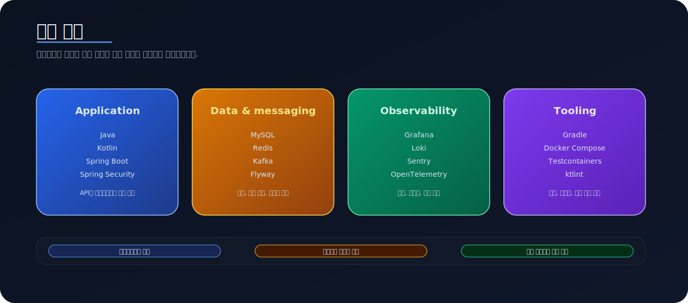
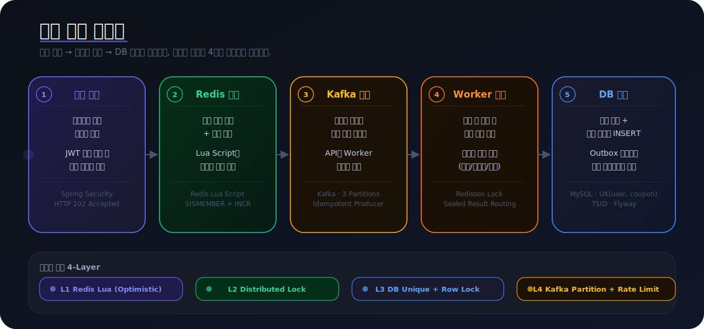

# 요쿠폰 (YoCoupon)

요쿠폰은 맛집 추천 서비스 [요기잇](https://yogieat.com/)에서 출발한 맛집 쿠폰 발급 시스템 프로젝트입니다.
맛집 추천을 받고 추천받은 맛집에서 사용할 수 있는 쿠폰을 발급하는 시스템으로, 선착순 이벤트와 같은 단시간에 트래픽이 급증하는 상황에서도 안정성과 성능을 보장하는 것을 목표로 합니다.
순간적으로 많은 요청이 몰리는 상황에서도 흐름이 한곳에 쏠리지 않도록, 요청 수신과 실제 처리를 나눠 설계했습니다.

이 저장소에서 보여주고 싶은 핵심은 단순합니다. 빠르게 받고, 중간에서 완충하고, 백그라운드에서 처리한 뒤, 최종 결과를 저장하는 흐름입니다.

## 한눈에 보기

- 빠른 요청 수신
- Redis를 통한 상태 확인
- Kafka를 통한 요청 완충
- Worker 기반 백그라운드 처리
- Database 중심 최종 저장
- 로그, 메트릭, 오류 추적까지 포함한 운영 가시성

## 기술 스택

애플리케이션은 Kotlin과 Spring Boot를 중심으로 구성했고, 데이터와 메시지 흐름은 MySQL, Redis, Kafka로 풀었습니다. 운영 관점에서는 Grafana, Loki, Sentry, OpenTelemetry를 사용해 상태와 오류를 추적합니다.

## 쿠폰 발급 흐름

요청을 바로 한 지점에 몰아 넣지 않고, 확인과 완충, 처리와 저장을 단계적으로 나눠 가져가는 흐름입니다.

## 시스템 아키텍처

사용자 요청이 API Server, Redis, Kafka, Worker, Database로 이어지며 흘러가는 큰 구조를 한 장으로 정리했습니다.

## 모니터링 아키텍처

메트릭, 로그, 오류 추적을 각각 분리해 보고, 운영 대응에 필요한 신호를 빠르게 확인할 수 있게 구성했습니다.

## 더 읽어보기

- [현재 아키텍처 개요](docs/architecture/current-architecture-overview.md)
- [쿠폰 발급 런타임 설명](docs/architecture/coupon-issuance-runtime.md)
- [쿠폰 Kafka 흐름 가이드](coupon/coupon-worker/docs/coupon-kafka-runtime-guide.md)
- [모니터링 관련 설계 메모](docs/architecture/loki-log-collector-choice.md)

## 관련 글

- [Redis Lua 스크립트로 원자적 쿠폰 발급 시스템 구축하기](https://www.ybchar.dev/tech-blog/20260412_lua_script)

[//]: # (- [TSID는 왜 사용하는가, AUTO_INCREMENT와 UUID 사이에서 찾은 균형]&#40;docs/articles/why-tsid.mdx&#41;)
