# Coupon Kafka Runtime Guide

## 목적

이 문서는 저장소의 쿠폰 시스템을 빠르게 따라올 수 있도록 정리한 운영 가이드다.

Kafka 자체 개념과 국내 사례 중심의 학습용 문서는 먼저
[`kafka-learning-guide.md`](./kafka-learning-guide.md)를 읽는 것을 권장한다.

운영 관점의 다음 문서는 아래 순서로 읽는다.

- [`kafka-broker-topology-evolution.md`](./kafka-broker-topology-evolution.md)
- [`kafka-topic-governance.md`](./kafka-topic-governance.md)
- [`kafka-dlq-replay-runbook.md`](./kafka-dlq-replay-runbook.md)

핵심 원칙은 세 가지다.

- `t_coupon_issue_request`가 발급 요청 상태의 source of truth다.
- `t_outbox_event`는 DB와 Kafka 사이의 유실 없는 릴레이 버퍼다.
- Kafka는 비동기 실행 버스이고, 최종 성공 여부는 DB request 상태가 결정한다.

즉, 이 구조는 "Kafka를 쓴다"보다 "요청이 절대 사라지지 않게 한다"가 먼저다.

## 한 장 요약

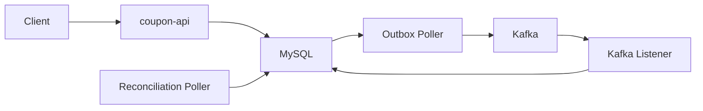

## 로컬 실행

### 1. 기본 실행

```bash
docker compose -f docker/docker-compose.yml up --build -d mysql redis kafka kafka-ui coupon-app coupon-worker
```

### 1-1. 왜 ZooKeeper를 쓰지 않는가

이 저장소의 로컬 compose는 Kafka를 `KRaft` 모드로 실행한다.

이유는 다음과 같다.

- 이 저장소의 목적은 쿠폰 발급 플로우를 빠르게 로컬에서 검증하는 것이다.
- 단일 브로커 개발 환경에서는 ZooKeeper를 따로 띄우는 비용이 크고, 학습 포인트도 분산된다.
- 동료 개발자가 처음 구조를 볼 때 `coupon-api -> outbox -> Kafka -> consumer -> request 상태 수렴`만 따라가도 충분해야 한다.
- 따라서 로컬 개발에서는 `broker + controller`를 한 컨테이너로 구성한 KRaft가 더 단순하다.

중요한 점은 이것이 "확장되면 결국 ZooKeeper로 돌아가야 한다"는 뜻은 아니라는 것이다.

- 새로운 운영 토폴로지는 KRaft를 기본값으로 본다.
- 기존 조직 표준이 ZooKeeper 기반일 때만 예외적으로 그 표준을 따라간다.
- 이 저장소는 로컬 개발과 구조 이해를 우선한 compose를 제공하고, 운영형 확장 계획은 별도 문서로 관리한다.

즉, 현재 compose의 판단 기준은 `구성 단순화`, 그리고 장기 기준은 `KRaft 기반 확장`이다.

### 2. 로컬 확인 포인트

| 대상 | 주소 | 의미 |
| --- | --- | --- |
| coupon-api | `http://localhost:18080` | 공개 HTTP API |
| coupon-worker actuator | `http://localhost:18081/actuator/health` | worker 설정/상태 확인 |
| Kafka UI | `http://localhost:18085` | relay publish 결과와 topic 확인 |
| MySQL | `localhost:3306` | request / outbox / coupon_issue 테이블 확인 |
| Redis | `localhost:6379` | lock/cache 확인 |

### 3. 동료 개발자가 가장 먼저 보면 좋은 것

1. `POST /coupon-issues` 호출
2. `t_coupon_issue_request`에서 `PENDING -> ENQUEUED -> PROCESSING -> SUCCEEDED` 확인
3. `t_outbox_event`에서 `COUPON_ISSUE_REQUESTED`가 `PENDING -> PROCESSING -> SUCCEEDED` 되는지 확인
4. Kafka UI에서 `coupon.issue.requested.v2` 메시지 확인
5. `t_coupon_issue` row 생성 확인

## 읽기 순서

이 저장소는 아래 순서로 읽으면 가장 이해가 쉽다.

1. API 진입점
   - [`CouponIssueController.kt`](../../coupon-api/src/main/kotlin/com.coupon/controller/coupon/CouponIssueController.kt)
   - [`CouponController.kt`](../../coupon-api/src/main/kotlin/com.coupon/controller/coupon/CouponController.kt)
2. 도메인 서비스
   - [`CouponIssueRequestService.kt`](../../coupon-domain/src/main/kotlin/com/coupon/coupon/request/CouponIssueRequestService.kt)
   - [`CouponIssueService.kt`](../../coupon-domain/src/main/kotlin/com/coupon/coupon/CouponIssueService.kt)
   - [`CouponService.kt`](../../coupon-domain/src/main/kotlin/com/coupon/coupon/CouponService.kt)
3. 비동기 실행기
   - [`OutboxPoller.kt`](../src/main/kotlin/com.coupon/outbox/OutboxPoller.kt)
   - [`CouponIssueRequestedOutboxEventHandler.kt`](../src/main/kotlin/com.coupon/outbox/CouponIssueRequestedOutboxEventHandler.kt)
   - [`CouponIssueRequestKafkaListener.kt`](../src/main/kotlin/com.coupon/kafka/CouponIssueRequestKafkaListener.kt)
4. 자기 복구 경로
   - [`CouponIssueRequestReconciliationService.kt`](../../coupon-domain/src/main/kotlin/com/coupon/coupon/request/CouponIssueRequestReconciliationService.kt)
   - [`CouponIssueRequestReconciliationPoller.kt`](../src/main/kotlin/com.coupon/reconciliation/CouponIssueRequestReconciliationPoller.kt)

## 쿠폰 API 맵

아래 표는 "이 API가 동기인지, Kafka를 타는지, 어디가 최종 상태인지"를 빠르게 보는 용도다.

| API | 성격 | 핵심 서비스 | Kafka 사용 여부 | 최종 상태 |
| --- | --- | --- | --- | --- |
| `POST /coupons` | 관리자 쓰기 | `CouponService.createCoupon()` | 아니오 | `t_coupon` |
| `GET /coupons` | 조회 | `CouponService.getCoupons()` | 아니오 | DB read |
| `GET /coupons/{couponId}` | 조회 | `CouponService.getCoupon()` | 아니오 | DB read |
| `POST /coupons/{couponId}/preview` | 검증/계산 | `CouponService.preview()` | 아니오 | 계산 결과 |
| `GET /coupons/{couponId}/coupon-issues` | 조회 | `CouponIssueService.getCouponIssues()` | 아니오 | DB read |
| `PUT /coupons/{couponId}` | 관리자 쓰기 | `CouponService.modifyCoupon()` | 아니오 | `t_coupon` |
| `POST /coupons/{couponId}/activate` | 관리자 쓰기 | `CouponService.activateCoupon()` | 아니오 | `t_coupon` |
| `POST /coupons/{couponId}/deactivate` | 관리자 쓰기 | `CouponService.deactivateCoupon()` | 아니오 | `t_coupon` |
| `DELETE /coupons/{couponId}` | 관리자 쓰기 | `CouponService.deleteCoupon()` | 아니오 | `t_coupon` |
| `POST /coupon-issues` | 공개 발급 API + Redis 선점 | `CouponIssueService.issue()` | 예 | Redis state, Kafka message |
| `GET /coupon-issues/my` | 조회 | `CouponIssueService.getMyCoupons()` | 아니오 | DB read |
| `GET /coupon-issues/{couponIssueId}` | 조회 | `CouponIssueService.getCouponIssue()` | 아니오 | DB read |
| `POST /coupon-issues/{couponIssueId}/use` | 동기 상태 전이 + outbox | `CouponIssueService.useCoupon()` | 후속 fan-out만 사용 | `t_coupon_issue` |
| `POST /coupon-issues/{couponIssueId}/cancel` | 동기 상태 전이 + outbox | `CouponIssueService.cancelCoupon()` | 후속 fan-out만 사용 | `t_coupon_issue`, `t_coupon` |

## 상태 모델

### Coupon Issue Request

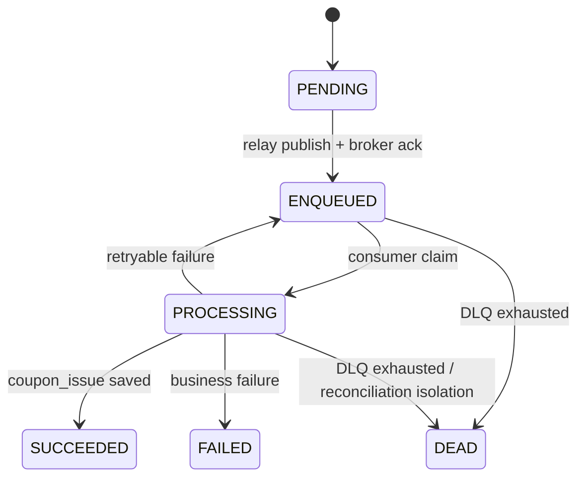

### Outbox Event

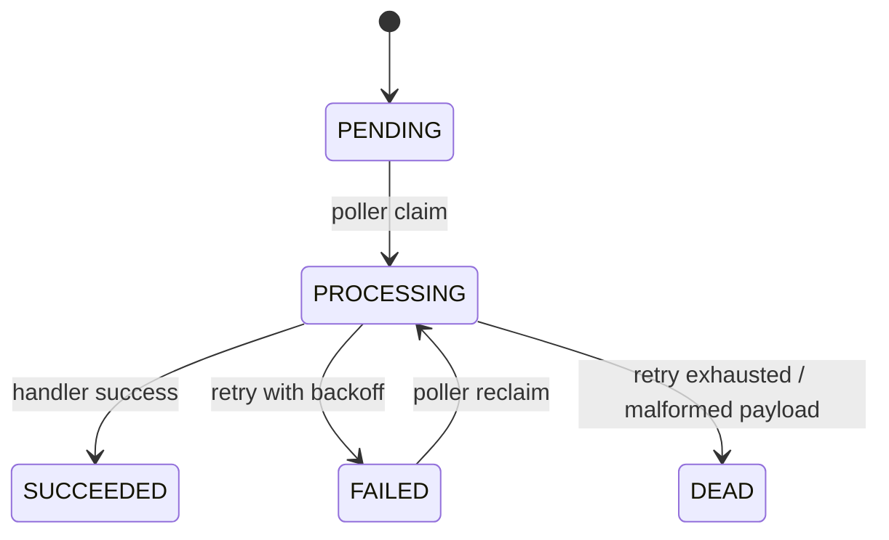

## API Flow Diagrams

### A. 관리자 쿠폰 쓰기 API

대상 API

- `POST /coupons`
- `PUT /coupons/{couponId}`
- `POST /coupons/{couponId}/activate`
- `POST /coupons/{couponId}/deactivate`
- `DELETE /coupons/{couponId}`

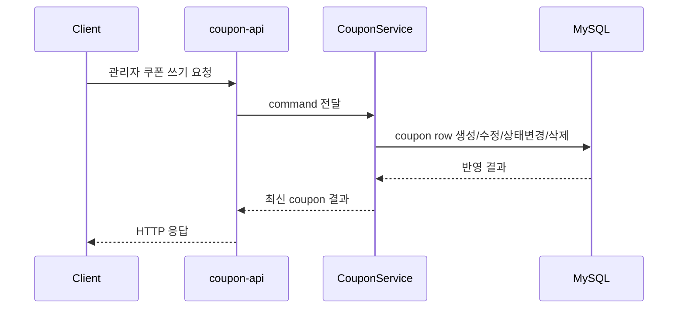

### B. 쿠폰 조회 API

대상 API

- `GET /coupons`
- `GET /coupons/{couponId}`
- `GET /coupons/{couponId}/coupon-issues`
- `GET /coupon-issues/my`
- `GET /coupon-issues/{couponIssueId}`

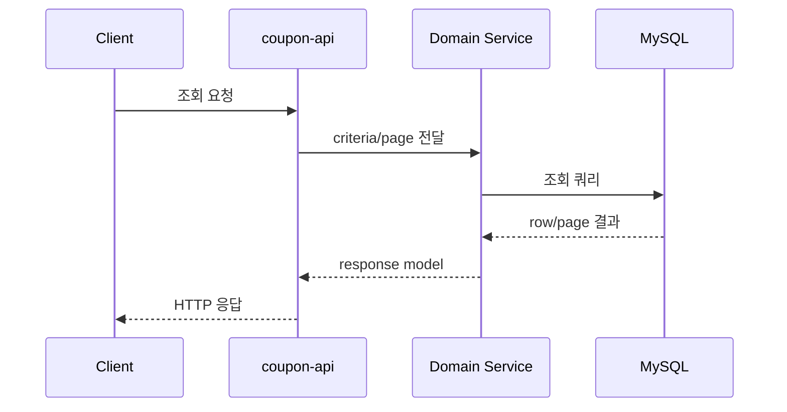

### C. 쿠폰 미리보기 API

대상 API

- `POST /coupons/{couponId}/preview`

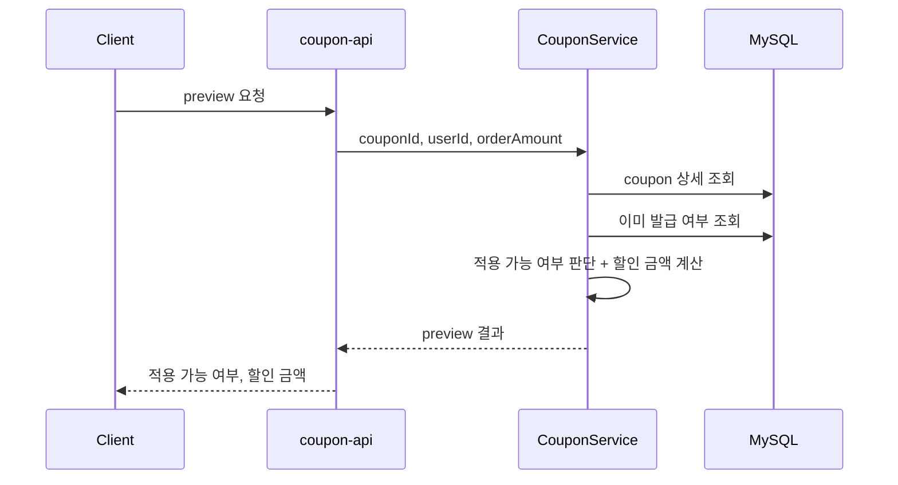

### D. 공개 쿠폰 발급 API

대상 API

- `POST /coupon-issues`

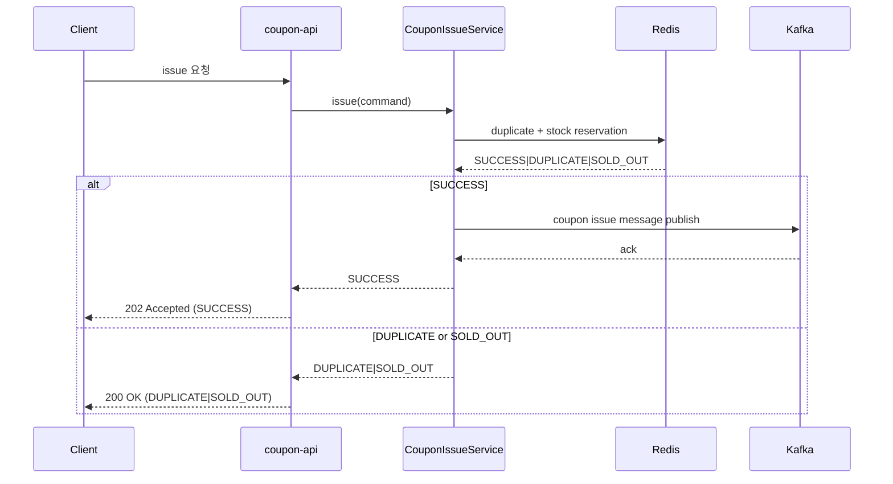

### E. Outbox Relay + Kafka + Consumer

이 다이어그램이 이 구조의 핵심이다.  
`POST /coupon-issues`로 생성된 요청은 아래 경로를 통해 실제 발급으로 이어진다.

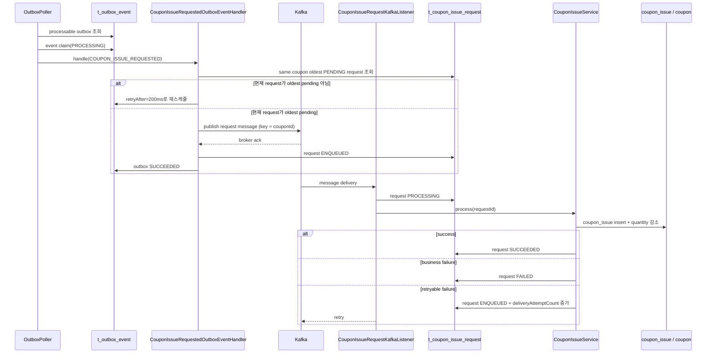

### G. 쿠폰 사용 API

대상 API

- `POST /coupon-issues/{couponIssueId}/use`

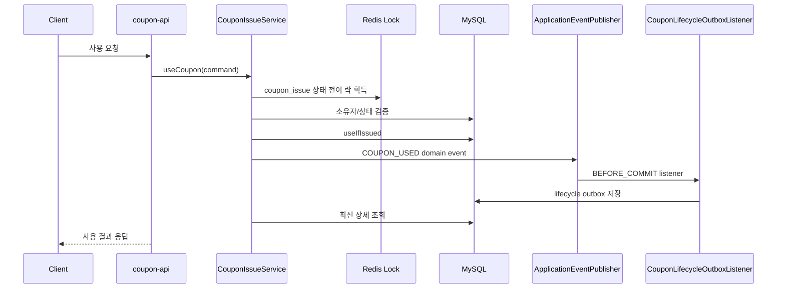

### H. 쿠폰 취소 API

대상 API

- `POST /coupon-issues/{couponIssueId}/cancel`

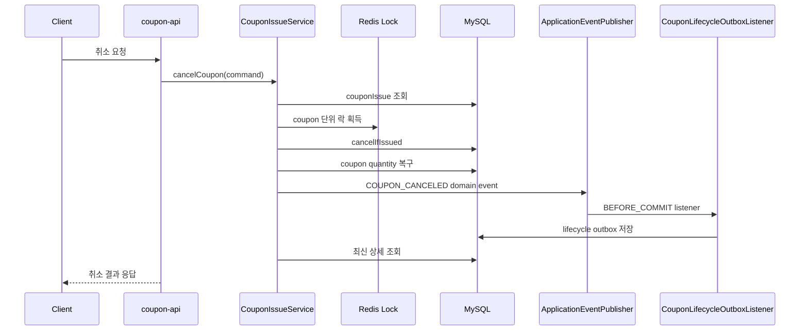

## 장애와 복구

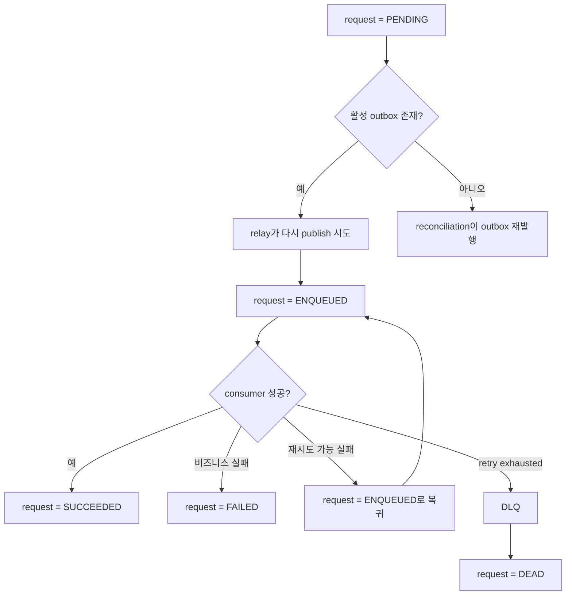

## 동료 개발자가 기억해야 할 규칙

1. Kafka 메시지가 성공이어도 최종 발급 성공은 아니다. `SUCCEEDED` request만 최종 성공이다.
2. request와 outbox는 항상 같은 트랜잭션에서 생성된다.
3. outbox는 "실행할 일"이고, Kafka는 "실행을 전달하는 버스"다.
4. strict FCFS는 `HOT_FCFS_ASYNC` 쿠폰에서만 요구하며, `couponId` key와 relay ordering gate로 보장한다.
5. `FAILED`는 비즈니스 실패고, `DEAD`는 시스템이 더 이상 자동 복구하지 못한 상태다.
6. lifecycle outbox(`COUPON_ISSUED`, `COUPON_USED`, `COUPON_CANCELED`)는 후속 read model과 감사 이력용이지 source of truth가 아니다.
7. 로컬 compose에서 ZooKeeper가 없는 이유는 Kafka가 중요하지 않아서가 아니라, 구조 학습에 필요 없는 구성 요소를 줄이기 위해서다.

## 디버깅 순서

### 발급 요청이 멈춘 것 같을 때

1. `t_coupon_issue_request` 상태를 본다.
2. 같은 request id의 `t_outbox_event`를 본다.
3. Kafka UI에서 `coupon.issue.requested.v2` 또는 DLQ를 본다.
4. worker actuator와 메트릭을 본다.
5. 그래도 이상하면 reconciliation 로그를 본다.

### 상태별 해석

| 상태 | 의미 | 먼저 볼 곳 |
| --- | --- | --- |
| `PENDING` | DB에는 저장됐지만 아직 relay 전 | outbox row |
| `ENQUEUED` | Kafka enqueue 완료, consumer 대기 또는 retry 대기 | Kafka lag, listener |
| `PROCESSING` | consumer가 실행 중이거나 중간 실패 | worker 로그, reconciliation |
| `SUCCEEDED` | 최종 발급 완료 | `t_coupon_issue` |
| `FAILED` | 명시적 비즈니스 실패 | resultCode, failureReason |
| `DEAD` | 자동 복구 경로 종료 | DLQ, reconciliation |

## 관련 문서

- [Phase 2. Outbox Worker Runtime](./phase-2-outbox-worker-runtime.md)
- [Phase 4. Coupon Request Reconciliation](./phase-4-coupon-request-reconciliation.md)
- [Phase 5. Kafka Relay + Consumer](./phase-5-kafka-relay-and-consumer.md)
