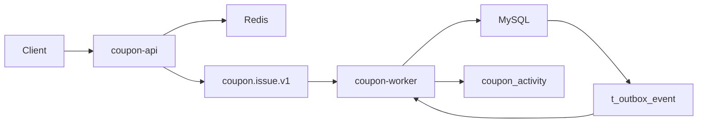
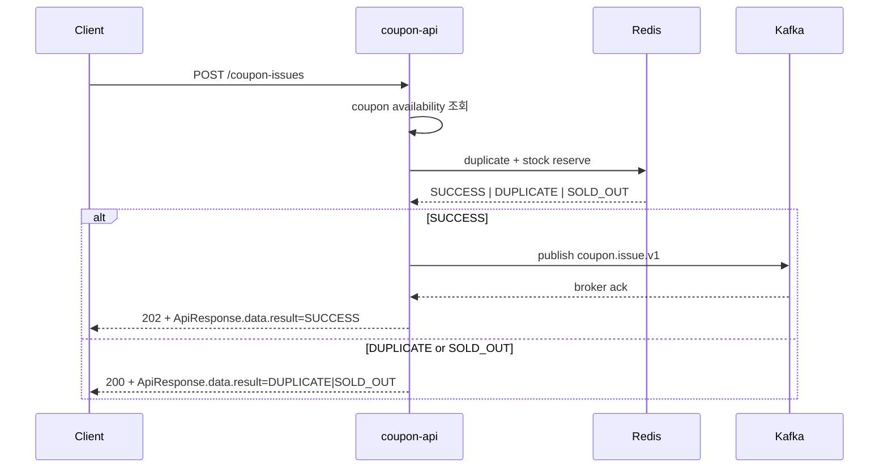
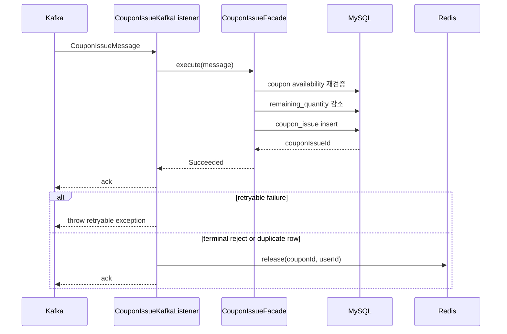
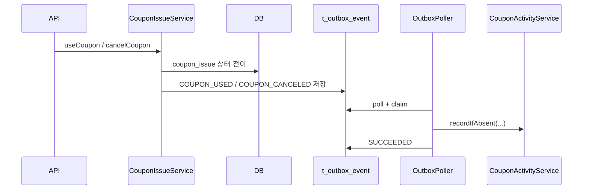

# Coupon Kafka Runtime Guide

## 목적

이 문서는 현재 저장소의 쿠폰 발급 런타임을 운영 관점에서 빠르게 이해하기 위한 최신 가이드다.

현재 구조의 핵심은 아래 두 줄이다.

- 공개 발급은 `Redis reserve -> direct Kafka publish -> worker consume -> coupon_issue persist`
- outbox worker는 발급 intake가 아니라 `issued/used/canceled` 후속 activity projection 을 처리한다

학습용 배경은 [kafka-learning-guide.md](./kafka-learning-guide.md), DLQ 대응은
[kafka-dlq-replay-runbook.md](./kafka-dlq-replay-runbook.md), topic 운영 원칙은
[kafka-topic-governance.md](./kafka-topic-governance.md)를 본다.

## 한 장 요약



## 핵심 원칙

- Redis는 발급 admission control 이다.
  - duplicate check
  - stock slot reserve
- Kafka는 accepted issue command bus 이다.
  - topic: `coupon.issue.v1`
  - DLQ: `coupon.issue.v1.dlq`
- 최종 source of truth 는 DB다.
  - 재고: `t_coupon.remaining_quantity`
  - 발급 결과: `t_coupon_issue`
- outbox는 issue intake relay 용도가 아니다.
  - `COUPON_ISSUED`
  - `COUPON_USED`
  - `COUPON_CANCELED`
  - 위 lifecycle 후속 projection 만 worker가 poll/dispatch 한다

## 로컬 실행

```bash
docker compose -f docker/docker-compose.yml up --build -d mysql redis kafka kafka-ui coupon-app coupon-worker
```

기본 확인 포인트:

| 대상 | 주소 | 의미 |
| --- | --- | --- |
| coupon-api | `http://localhost:18080` | 공개 HTTP API |
| coupon-worker actuator | `http://localhost:18081/actuator/health` | worker 상태 |
| Kafka UI | `http://localhost:18085` | issue topic / DLQ 확인 |
| MySQL | `localhost:3306` | coupon / coupon_issue / outbox 확인 |
| Redis | `localhost:6379` | coupon issue state 확인 |

가장 빠른 로컬 체크 순서:

1. `POST /coupon-issues`
2. Redis state 증가 확인
3. Kafka UI 에서 `coupon.issue.v1` publish 확인
4. `t_coupon.remaining_quantity` 감소 확인
5. `t_coupon_issue` row 생성 확인
6. `t_outbox_event` 에서 `COUPON_ISSUED` 후속 event 생성/처리 확인

## 현재 API 맵

| API | 성격 | 핵심 진입점 | Kafka 사용 여부 | 최종 상태 |
| --- | --- | --- | --- | --- |
| `POST /coupons` | 관리자 쓰기 | `CouponService.createCoupon()` | 아니오 | `t_coupon` |
| `GET /coupons` | 조회 | `CouponService.getCoupons()` | 아니오 | DB read |
| `GET /coupons/{couponId}` | 조회 | `CouponService.getCoupon()` | 아니오 | DB read |
| `POST /coupons/{couponId}/preview` | 검증/계산 | `CouponService.preview()` | 아니오 | 계산 결과 |
| `PUT /coupons/{couponId}` | 관리자 쓰기 | `CouponService.modifyCoupon()` | 아니오 | `t_coupon` |
| `POST /coupons/{couponId}/activate` | 관리자 쓰기 | `CouponService.activateCoupon()` | 아니오 | `t_coupon` |
| `POST /coupons/{couponId}/deactivate` | 관리자 쓰기 | `CouponService.deactivateCoupon()` | 아니오 | `t_coupon` |
| `DELETE /coupons/{couponId}` | 관리자 쓰기 | `CouponService.deleteCoupon()` | 아니오 | `t_coupon` |
| `POST /coupon-issues` | 공개 발급 intake | `CouponIssueFacade.issue()` | 예 | Redis reserve + Kafka ack |
| `GET /coupon-issues/my` | 조회 | `CouponIssueService.getMyCoupons()` | 아니오 | DB read |
| `GET /coupon-issues/coupons/{couponId}` | 관리자용 발급 목록 조회 | `CouponIssueService.getCouponIssues()` | 아니오 | DB read |
| `GET /coupon-issues/{couponIssueId}` | 조회 | `CouponIssueService.getCouponIssue()` | 아니오 | DB read |
| `POST /coupon-issues/{couponIssueId}/use` | 동기 상태 전이 | `CouponIssueService.useCoupon()` | 후속 outbox만 사용 | `t_coupon_issue` |
| `POST /coupon-issues/{couponIssueId}/cancel` | 동기 상태 전이 | `CouponIssueFacade.cancelCoupon()` | 후속 outbox만 사용 | `t_coupon_issue`, `t_coupon` |

## Redis 상태 모델

현재 Redis state 는 쿠폰별 두 키로 유지한다.

- occupied count
  - `coupon:issue:state:{couponId}:occupied-count`
- reserved user set
  - `coupon:issue:state:{couponId}:users`

보장하려는 의미:

- 같은 사용자는 한 번만 reserve 된다
- reserved slot 수가 `totalQuantity` 를 넘지 않는다
- publish 실패나 DLQ 확정 시 slot 과 user marker 를 풀어준다
- Redis flush 이후에는 DB 기준으로 rebuild 할 수 있다

관련 파일:

- [`CouponIssueService.kt`](../../coupon-domain/src/main/kotlin/com/coupon/coupon/CouponIssueService.kt)
- [`CouponIssueRedisRepository.kt`](../../coupon-domain/src/main/kotlin/com/coupon/coupon/CouponIssueRedisRepository.kt)
- [`CouponIssueRedisCoreRepository.kt`](../../../storage/redis/src/main/kotlin/com/coupon/redis/coupon/CouponIssueRedisCoreRepository.kt)

## 현재 Kafka 설정

| 항목 | 값 | 파일 |
| --- | --- | --- |
| topic | `coupon.issue.v1` | [`CouponIssueKafkaProperties.kt`](../src/main/kotlin/com.coupon/config/CouponIssueKafkaProperties.kt) |
| DLQ topic | `coupon.issue.v1.dlq` | 같은 파일 |
| group id | `coupon-issue-group` | 같은 파일 |
| DLQ group id | `coupon-issue-dlq-group` | 같은 파일 |
| partition key | `couponId.toString()` | [`CouponIssueKafkaPublisher.kt`](../../coupon-api/src/main/kotlin/com.coupon/config/CouponIssueKafkaPublisher.kt) |
| consumer concurrency | `3` | [`worker.yml`](../src/main/resources/worker.yml) |

## 흐름도

### 1. 공개 발급 intake



### 2. worker 실행 경로



### 3. use / cancel 후속 outbox



outbox 상태 규칙 요약:

- `PENDING`, `FAILED` 만 poll 대상이다
- `PROCESSING` 은 timeout 뒤 `FAILED` 로 복구되면 다시 처리된다
- `DEAD` 는 terminal 상태이며 자동으로 `SUCCEEDED` 로 복귀하지 않는다
- `DEAD` 전환 성공 시 Slack webhook alert 를 best-effort 로 보낼 수 있다

## 운영 체크리스트

### 발급이 느리거나 누락된 것처럼 보일 때

1. `POST /coupon-issues` 응답의 `data.result` 를 먼저 본다
2. `SUCCESS` 였다면 Kafka UI 에서 `coupon.issue.v1` lag 를 본다
3. `coupon-worker` 로그에서 retry 또는 DLQ 이동 여부를 본다
4. `t_coupon_issue` 생성 여부와 `t_coupon.remaining_quantity` 를 확인한다
5. Redis state 가 남아 있는데 DB 발급이 없으면 DLQ 또는 publish failure 보상 경로를 확인한다

### DLQ가 늘 때

1. `coupon.issue.v1.dlq` 메시지 증가 확인
2. worker DLQ 로그 확인
3. 같은 `couponId/userId` 의 `t_coupon_issue` row 존재 여부 확인
4. Redis release 가 수행됐는지 확인
5. 필요하면 [kafka-dlq-replay-runbook.md](./kafka-dlq-replay-runbook.md) 순서로 대응

### outbox DEAD가 발생할 때

로컬 Slack 설정은 저장소 루트 `[.env](/Users/yunbeom/ybcha/coupon-system-design-kt/.env)` 기준으로 관리한다. 예시는 `[.env.example](/Users/yunbeom/ybcha/coupon-system-design-kt/.env.example)`를 사용한다.

1. Slack alert 의 `eventId`, `eventType`, `aggregate` 를 먼저 확인한다
2. `t_outbox_event` 에서 해당 row 의 `status`, `retry_count`, `last_error`, `processed_at` 을 본다
3. malformed payload 인지, handler 미등록인지, retry 소진인지 reason 을 분류한다
4. `coupon_activity` row 존재 여부를 함께 확인해 side effect 중복 가능성을 본다
5. 재처리가 필요하면 수동 replay 전략을 정하고, 단순 `DEAD -> PENDING` 변경은 원인 제거 후에만 한다

### Redis flush 이후

- 첫 reserve 요청 또는 운영 rebuild 시 `CouponIssueService.rebuildState()` 가 DB 기준으로 state 를 재구성한다
- occupied count 기준은 `totalQuantity - remainingQuantity`
- reserved user set 기준은 이미 발급된 user id 집합이다

## 읽기 순서

1. [`CouponIssueController.kt`](../../coupon-api/src/main/kotlin/com.coupon/controller/coupon/CouponIssueController.kt)
2. [`CouponIssueFacade.kt`](../../coupon-domain/src/main/kotlin/com/coupon/coupon/CouponIssueFacade.kt)
3. [`CouponIssueService.kt`](../../coupon-domain/src/main/kotlin/com/coupon/coupon/CouponIssueService.kt)
4. [`CouponIssueKafkaPublisher.kt`](../../coupon-api/src/main/kotlin/com.coupon/config/CouponIssueKafkaPublisher.kt)
5. [`CouponIssueKafkaListener.kt`](../src/main/kotlin/com.coupon/kafka/CouponIssueKafkaListener.kt)
6. [`phase-2-outbox-worker-runtime.md`](./phase-2-outbox-worker-runtime.md)
