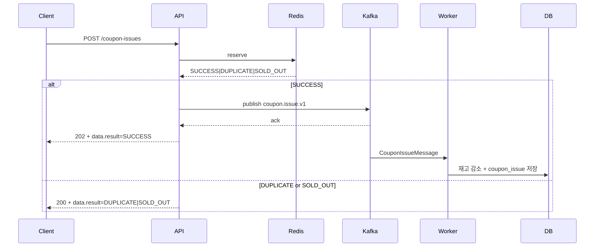

# Kafka Learning Guide

## 목적

이 문서는 현재 저장소에서 Kafka 가 왜 필요한지, 무엇을 맡고 무엇을 맡지 않는지 설명하는 학습용 문서다.

최신 구현 자체를 빠르게 따라가려면 [coupon-kafka-runtime-guide.md](./coupon-kafka-runtime-guide.md) 를 먼저 본다.

## 지금 Kafka 가 하는 일

현재 Kafka 는 공개 발급 요청 중 **accepted 된 command** 만 비동기로 worker 로 전달한다.

즉, 현재 구조는 아래 역할 분담이다.

- Redis
  - duplicate check
  - stock slot reserve
- Kafka
  - accepted issue command transport
  - retry / DLQ 제공
- MySQL
  - 최종 재고와 발급 source of truth
- Outbox worker
  - issue intake 가 아니라 lifecycle projection 처리

## 지금 Kafka 가 하지 않는 일

현재는 아래를 Kafka 가 맡지 않는다.

- request table 의 source of truth 역할
- issue acceptance 영속 저장
- outbox relay 기반 issue enqueue

즉, 예전의 `request + outbox + reconciliation` 모델은 현재 구조가 아니다.

## 현재 end-to-end 흐름

## 왜 이 구조를 택했는가

### 1. HTTP 응답과 실제 발급 실행을 분리하고 싶다

worker retry 와 DLQ 는 HTTP request lifetime 밖에서 처리하는 편이 낫다.

### 2. hot coupon ordering 을 couponId key 로 유지하고 싶다

같은 couponId 는 같은 partition 으로 보내서 순서를 단순화한다.

### 3. duplicate / sold-out 은 API 입구에서 빨리 자르고 싶다

Redis reserve 가 이 역할을 담당한다.

## 그러면 최종 truth 는 어디인가

Kafka 가 아니다.

최종 truth 는 아래 두 테이블/상태다.

- `t_coupon.remaining_quantity`
- `t_coupon_issue`

Kafka message 가 성공적으로 publish 되어도 발급 성공 자체와 동일하지는 않다. 최종 성공은 worker 가 DB write 를 끝냈을 때다.

## retry 와 DLQ 는 어떻게 동작하나

- retryable failure
  - Kafka error handler 가 backoff retry
- retry exhausted
  - `coupon.issue.v1.dlq`
  - DLQ listener 가 Redis reserve release

의미:

- 메시지가 완전히 실패하면 같은 사용자가 다시 시도할 기회를 되돌려 준다

## outbox 는 왜 아직 남아 있나

현재 outbox 는 lifecycle follow-up projection 용도다.

예:

- coupon issued
- coupon used
- coupon canceled

이 이벤트들은 domain event -> outbox -> worker -> `coupon_activity` projection 으로 이어진다.

즉, issue intake 와 outbox worker 는 현재 별도 경로다.

## 용어 정리

| 용어 | 현재 의미 |
| --- | --- |
| `SUCCESS` | Redis reserve + Kafka ack 성공 |
| `DUPLICATE` | 이미 같은 사용자가 해당 쿠폰에 참여함 |
| `SOLD_OUT` | reserve 시점에 재고 슬롯 없음 |
| retry | worker consumer 재시도 |
| DLQ | retry 소진 후 최종 격리 |
| outbox | lifecycle projection durability |

## 코드를 읽는 순서

1. [`CouponIssueController.kt`](../../coupon-api/src/main/kotlin/com.coupon/controller/coupon/CouponIssueController.kt)
2. [`CouponIssueFacade.kt`](../../coupon-domain/src/main/kotlin/com/coupon/coupon/CouponIssueFacade.kt)
3. [`CouponIssueService.kt`](../../coupon-domain/src/main/kotlin/com/coupon/coupon/CouponIssueService.kt)
4. [`CouponIssueKafkaPublisher.kt`](../../coupon-api/src/main/kotlin/com.coupon/config/CouponIssueKafkaPublisher.kt)
5. [`CouponIssueKafkaListener.kt`](../src/main/kotlin/com.coupon/kafka/CouponIssueKafkaListener.kt)
6. [`phase-2-outbox-worker-runtime.md`](./phase-2-outbox-worker-runtime.md)
