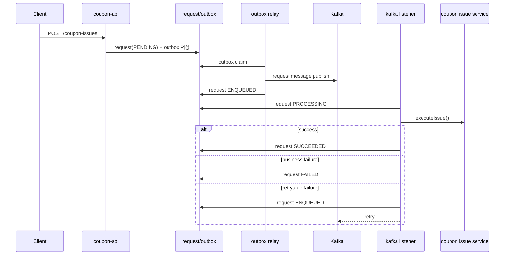

# Kafka Learning Guide For Coupon System

## 문서 목적

이 문서는 "Kafka가 무엇인지"를 설명하는 문서이면서 동시에  
"왜 현재 쿠폰 시스템에 Kafka를 붙였는지"를 이해시키기 위한 문서다.

따라서 이 문서는 두 질문에 답한다.

1. Kafka를 이해하려면 무엇을 먼저 알아야 하는가?
2. Kafka를 이 쿠폰 시스템에 도입했을 때 어떤 문제를 줄이고 어떤 책임을 분리할 수 있는가?

이 문서는 입문자, 특히 주니어 개발자가 아래 순서로 이해하도록 작성했다.

1. Kafka 이해
2. Kafka를 쓰는 목적 이해
3. Kafka가 만능이 아니라는 점 이해
4. 현재 쿠폰 시스템에서 Kafka가 맡는 역할 이해

## 한 줄 정의

Kafka는 "이벤트를 안전하게 저장하고, 여러 소비자가 독립적으로 읽고, 필요하면 다시 읽을 수 있게 해주는 분산 로그 기반 메시징 플랫폼"이다.

이 저장소에서는 Kafka를 다음 역할로 사용한다.

- `coupon-api`가 받은 비동기 발급 요청을 worker로 전달하는 command bus
- outbox relay와 consumer를 분리하는 실행 버스
- request 상태를 `PENDING -> ENQUEUED -> PROCESSING -> SUCCEEDED|FAILED|DEAD` 로 수렴시키는 비동기 전달 계층

## Kafka를 이해하기 위한 핵심 키워드

### Event

이미 발생한 사실이다.

예시

- `CouponIssueRequested`
- `CouponIssued`
- `CouponUsed`
- `CouponCanceled`

좋은 이벤트 이름은 "무엇을 해라"보다 "무엇이 일어났다"에 가깝다.

### Topic

같은 종류의 이벤트를 모아두는 논리적 이름이다.

현재 저장소 기준 예시

- `coupon.issue.requested.v2`
- `coupon.issue.requested.v2.dlq`

### Partition

Topic을 병렬 처리 가능한 단위로 나눈 것이다.

중요한 사실은 다음이다.

- Kafka는 **Partition 내부 순서**만 보장한다.
- Topic 전체의 전역 순서를 보장하는 것이 아니다.
- 따라서 어떤 키로 파티셔닝할지 설계가 중요하다.

현재 저장소는 strict FCFS 경로에서 `couponId`를 record key로 사용한다.

### Producer

Kafka Topic에 메시지를 쓰는 쪽이다.

현재 저장소에서는 `coupon-worker` 내부의 outbox relay가 producer 역할을 한다.

- [`CouponIssueRequestKafkaPublisher.kt`](../src/main/kotlin/com.coupon/kafka/CouponIssueRequestKafkaPublisher.kt)

### Consumer

Kafka Topic에서 메시지를 읽어 처리하는 쪽이다.

현재 저장소에서는 `coupon-worker` 내부 Kafka listener가 consumer 역할을 한다.

- [`CouponIssueRequestKafkaListener.kt`](../src/main/kotlin/com.coupon/kafka/CouponIssueRequestKafkaListener.kt)

### Consumer Group

같은 Topic을 읽는 consumer 묶음이다.

핵심 규칙은 다음이다.

- 같은 group 안에서는 한 partition을 하나의 consumer만 읽는다.
- group이 다르면 같은 메시지를 서로 독립적으로 읽을 수 있다.

즉, "한 번 publish한 이벤트를 여러 용도로 재사용"할 수 있게 해준다.

### Offset

Consumer가 Topic을 어디까지 읽었는지 나타내는 위치다.

이 개념이 중요한 이유는 다음과 같다.

- 장애 후 재시작 위치를 정할 수 있다.
- 재처리 전략을 세울 수 있다.
- lag를 측정할 수 있다.

### Delivery Semantics

메시지가 어떤 보장 수준으로 전달되는지를 말한다.

- `At most once`: 유실 가능, 중복 거의 없음
- `At least once`: 유실은 줄이지만 중복 가능
- `Exactly once`: 이상적이지만 구현/운영 난이도가 높음

이 저장소는 Kafka 자체보다 더 바깥쪽에서 request 상태 테이블과 idempotency로 정합성을 잡는다.  
즉, Kafka만 믿지 않고 DB truth와 멱등성 장치를 함께 둔다.

### Idempotency

같은 메시지가 두 번 와도 결과를 한 번 처리한 것처럼 만드는 성질이다.

Kafka를 쓰면 중복 가능성을 항상 염두에 둬야 한다.  
그래서 이 저장소에서는 다음 두 축으로 멱등성을 확보한다.

- `t_coupon_issue_request` 상태 전이
- `coupon_issue` 유니크 제약 / 도메인 검증

### DLQ

재시도를 다 써도 정상 처리하지 못한 메시지를 격리하는 큐다.

현재 저장소에서는 다음 topic이 DLQ다.

- `coupon.issue.requested.v2.dlq`

DLQ의 의미는 "버린다"가 아니라 "자동 복구는 여기까지, 이제 명시적 상태로 격리한다"에 가깝다.

### Outbox

DB 상태 변경과 메시지 발행 사이의 간극을 줄이기 위한 패턴이다.

현재 저장소에서 Kafka보다 더 중요한 것은 사실 outbox다.

왜냐하면 현재 구조의 핵심 목표는 "Kafka를 쓴다"가 아니라 다음이기 때문이다.

- 요청이 절대 조용히 사라지지 않아야 한다.
- request row와 메시지 발행 의도가 같은 트랜잭션에 묶여야 한다.

즉, Kafka는 실행 버스이고, outbox는 정합성 장치다.

## Kafka를 배우기 전에 필요한 선수 지식

Kafka 자체 문법보다 아래 개념이 먼저다.

### 1. 트랜잭션

다음을 이해해야 한다.

- 한 트랜잭션 안에서 무엇이 함께 성공/실패해야 하는가
- DB commit 전에 이벤트를 쓰는 이유는 무엇인가
- "DB 저장 성공, 메시지 발행 실패"가 왜 위험한가

### 2. Lock과 경합

쿠폰 시스템은 race condition이 자주 발생한다.

예시

- 중복 발급
- 수량 초과 발급
- 사용/취소 상태 경합

Kafka가 lock을 대체해 주지는 않는다.  
Kafka는 비동기 전달 수단이지, 도메인 락 자체가 아니다.

### 3. 멱등성

Kafka를 도입하면 "같은 메시지가 다시 올 수 있다"를 기본값으로 생각해야 한다.

### 4. 상태 모델링

특히 이 저장소에서는 다음 상태 모델이 중요하다.

- `PENDING`
- `ENQUEUED`
- `PROCESSING`
- `SUCCEEDED`
- `FAILED`
- `DEAD`

주니어가 Kafka를 이해하려면, 사실 Kafka API보다 이 상태 모델을 먼저 이해하는 편이 낫다.

### 5. 분산 시스템 기본기

다음을 받아들여야 한다.

- 네트워크는 실패할 수 있다.
- ack를 못 받았다고 해서 broker 저장도 실패한 것은 아닐 수 있다.
- consumer가 처리 후 죽으면 재전달될 수 있다.
- 메시지 브로커를 도입해도 정합성 문제는 사라지지 않는다.

## Kafka의 목적

Kafka를 도입하는 목적은 보통 다음 중 하나 이상이다.

### 1. 비동기화

API 요청 스레드가 오래 붙잡고 있던 일을 뒤로 넘긴다.

현재 쿠폰 시스템에서는 `POST /coupon-issues` 가 이 목적을 가진다.

### 2. 결합도 완화

서비스 간 직접 호출 대신 이벤트를 발행하고 구독하게 만든다.

### 3. 확장성

consumer를 늘려 처리량을 높이거나, 새로운 consumer group을 붙여서 다른 용도로 같은 이벤트를 재사용할 수 있다.

### 4. 재처리 가능성

offset 기반으로 장애 복구나 재실행 전략을 세울 수 있다.

### 5. 이벤트 기반 아키텍처 확장

나중에 analytics, audit, projection, CDC, stream processing으로 발전하기 쉽다.

## Kafka가 해결하지 못하는 것

주니어가 가장 많이 오해하는 부분이라 따로 적는다.

Kafka를 도입해도 자동으로 해결되지 않는 것들이다.

- 비즈니스 정합성
- 중복 발급 방지
- 재고 감소 원자성
- 잘못된 success 응답
- 잘못 설계된 상태 모델

즉, Kafka는 구조를 좋게 만들 수는 있지만, 잘못된 도메인 모델을 구해주지는 않는다.

## 현재 쿠폰 시스템에서 Kafka를 도입한 이유

이 저장소의 Kafka 도입 배경은 다음 한 문장으로 요약된다.

> "쿠폰 발급 요청을 빠르게 안전하게 접수하고, 실제 실행은 worker로 넘기되, 요청 유실 없이 최종 상태를 DB에 남기기 위해."

### Kafka 도입 전 문제의식

이 저장소는 reliability-first를 우선한다.

즉, 다음을 먼저 해결하려고 한다.

- 요청 유실 0
- 성공 응답 후 미반영 0
- retry 후에도 애매한 상태가 남지 않음
- 실패는 `FAILED` 또는 `DEAD`로 명시됨

동기 발급만으로는 처리 시간이 길어질 수 있고, request acceptance와 실제 실행을 분리하기 어렵다.  
반대로 Kafka만 바로 붙이면 DB request truth와 메시지 발행 사이의 gap이 생긴다.

그래서 현재 구조는 다음 조합을 택했다.

- DB request table
- DB outbox
- Kafka relay
- Kafka consumer
- reconciliation

즉, Kafka는 단독 해법이 아니라 outbox와 함께 들어간다.

## 현재 저장소에서 Kafka가 들어간 실제 플로우

## 왜 Kafka를 outbox 뒤에 두는가

이 질문이 중요하다.

현재 저장소는 Kafka direct publish가 아니라 outbox relay 방식을 쓴다.

이유는 다음과 같다.

### 1. request DB가 source of truth이기 때문

현재 시스템에서 최종 truth는 Kafka가 아니라 `t_coupon_issue_request`다.

### 2. dual write 문제를 줄이기 위해

다음 상황을 막고 싶다.

- request는 DB에 저장됐는데 Kafka publish 실패
- Kafka는 publish 됐는데 request row 저장 실패

### 3. reconciliation을 붙이기 위해

오래된 `PENDING`, `PROCESSING`, 불가능한 `SUCCEEDED` 상태를 DB 기준으로 복구/격리할 수 있어야 한다.

## Kafka를 이해하는 데 필요한 주제 목록

아래 주제는 "알아두면 좋다"가 아니라, Kafka를 실무에서 안전하게 쓰려면 결국 알아야 하는 목록이다.

### 입문 주제

- Topic
- Partition
- Producer
- Consumer
- Consumer Group
- Offset
- Ack
- Retry
- DLQ

### 중급 주제

- Key 기반 파티셔닝
- Delivery semantics
- Idempotent producer
- Rebalance
- Lag
- Backpressure
- Ordering guarantee

### 실무 주제

- Transactional Outbox
- CDC / Kafka Connect
- Event Bus
- Schema evolution
- Reprocessing
- DLQ 운영 기준
- Exactly once vs At least once trade-off

### 고급 주제

- Kafka Streams
- ksqlDB
- CDC source / sink pipeline
- CQRS projection
- Stream join / aggregation

## 국내 기업 사례로 보는 Kafka 학습 포인트

## 1. 올리브영: 쿠폰 발급 비동기화는 빠르지만 정합성 비용이 뒤따른다

올리브영의 쿠폰 관련 글들은 "비동기화가 왜 필요한가"와 "비동기화 후에 어떤 문제를 다시 해결해야 하는가"를 잘 보여준다.

### 배울 점

- 동기 발급은 대량 트래픽에서 DB connection을 오래 점유할 수 있다.
- worker 구조로 넘기면 응답 시간을 줄일 수 있다.
- 하지만 전달 수단이 신뢰성을 충분히 보장하지 않으면 유실이 생긴다.
- MQ를 도입해도 `time gap`, 이중 검증, Redis 원자성 문제가 남을 수 있다.

### 이 저장소에 주는 시사점

- Kafka 도입 자체보다 `success 응답의 의미`를 먼저 정의해야 한다.
- 발급 요청 accepted와 실제 발급 success를 분리해야 한다.
- 그래서 현재 저장소는 `POST /coupon-issues` 에서 `202 Accepted`를 반환한다.

## 2. 우아한형제들: Kafka는 이벤트 브로커이자 event bus이고, outbox와 함께 써야 안전하다

우아한형제들 글은 Kafka를 단순 큐가 아니라 "이벤트 순서 보장"과 "분산 시스템 통지"의 관점으로 설명한다.

### 배울 점

- 도메인 이벤트는 순서가 중요할 수 있다.
- Kafka를 event bus로 사용하면 여러 서버 그룹에 같은 이벤트를 전파할 수 있다.
- Transactional Outbox를 같이 두면 메시지 유실과 순서 문제를 줄일 수 있다.

### 이 저장소에 주는 시사점

- request acceptance는 DB + outbox로 묶고
- Kafka는 relay 이후 실행 버스로만 써야 한다.

## 3. 카카오페이: Kafka는 처리량과 구조 개선에 유용하지만, 튜닝 없이 성과가 나오지 않는다

카카오페이 지연이체 사례는 Kafka를 도입한 뒤에도 consumer 수, batch size, thread 수 같은 런타임 튜닝이 중요하다는 점을 보여준다.

### 배울 점

- Kafka 도입 후에도 처리량은 consumer 구조에 크게 좌우된다.
- 메시지를 읽는 수, 스레드 수, 실행 병렬도가 실제 결과를 만든다.
- "Kafka를 붙였다"보다 "Kafka를 어떻게 소비하느냐"가 중요하다.

### 이 저장소에 주는 시사점

- 앞으로 `concurrency`, `max.poll.records`, retry 정책은 운영 지표 기반으로 조정해야 한다.
- 지금은 reliability-first라 보수적으로 두고, 이후 성능 단계에서 튜닝하는 것이 맞다.

## 4. 카카오페이 / 하이퍼커넥트: Kafka는 CQRS, CDC, 데이터 파이프라인 확장의 출발점이 될 수 있다

Kafka는 단순 업무 큐가 아니라, 데이터 흐름을 다른 읽기 모델이나 검색 시스템으로 연결하는 기반이 되기도 한다.

### 배울 점

- CDC source/sink를 붙이면 DB 변경 흐름을 다른 저장소로 보낼 수 있다.
- CQRS에서는 command 모델과 query 모델을 분리할 수 있다.
- offset과 consumer group 관리가 실제 운영에 중요하다.

### 이 저장소에 주는 시사점

- 현재 `t_coupon_activity` 같은 projection은 나중에 Kafka fan-out consumer로 분리할 수 있다.
- 지금은 local worker지만, 나중에는 analytics / audit / notification group을 분리할 수 있다.

## 5. 하이퍼커넥트: Kafka Streams / ksqlDB는 "Kafka 이후"에 배우면 된다

Kafka Streams나 ksqlDB는 강력하지만, 입문자가 제일 먼저 붙잡을 주제는 아니다.

### 먼저 알아야 하는 것

- producer / consumer
- topic / partition / offset
- retry / DLQ
- outbox / idempotency

그 다음에야 stream join, aggregation, state store 같은 주제가 들어온다.

## 왜 우리 쿠폰 시스템에 Kafka가 맞는가

이 저장소의 Kafka 도입 이유를 실무식으로 정리하면 다음과 같다.

### 1. 요청 수락과 실제 실행을 분리할 수 있다

`POST /coupon-issues`는 짧게 끝나고, 실제 발급은 worker가 처리한다.

### 2. worker scale-out이 가능하다

나중에 발급 요청량이 늘면 consumer 확장 여지가 생긴다.

### 3. 후속 consumer 확장이 가능하다

지금은 request issue만 Kafka를 타지만, 앞으로 lifecycle fan-out으로 넓힐 수 있다.

### 4. 재처리와 장애 수렴 구조를 만들 수 있다

retry, DLQ, reconciliation과 결합하면 "조용한 유실"을 줄이기 쉽다.

## Kafka를 도입해서 얻는 이점

현재 쿠폰 시스템 맥락에서는 다음 이점을 얻는다.

### 구조적 이점

- API와 worker 책임 분리
- request acceptance와 execution 분리
- 후속 확장 포인트 확보

### 안정성 이점

- request 상태가 DB에 남음
- retry / DLQ / reconciliation 가능
- 실패가 명시적 상태로 수렴

### 운영 이점

- Kafka UI, offset, lag 관측 가능
- consumer concurrency 조정 가능
- 토픽 단위로 흐름 추적 가능

### 확장 이점

- 나중에 analytics / projection / audit / CDC 확장 가능
- Kafka Streams / ksqlDB / CDC Connect로 진화 가능

## Kafka를 도입해도 여전히 주의할 점

### 1. success 응답의 의미를 잘못 정의하면 안 된다

request accepted와 issuance succeeded를 구분해야 한다.

### 2. 멱등성을 빼먹으면 안 된다

중복 delivery는 언젠가 온다.

### 3. Kafka만 믿고 DB truth를 버리면 안 된다

현재 저장소는 request table이 핵심이다.

### 4. Topic 설계보다 상태 모델이 먼저다

상태 모델이 약하면 Kafka를 붙여도 복잡성만 늘어난다.

### 5. 성능 최적화는 reliability 이후다

이 저장소는 지금 이 원칙을 따르고 있다.

## 이 저장소를 기준으로 추천하는 Kafka 학습 순서

1. 이 문서를 읽는다.
2. [`coupon-kafka-runtime-guide.md`](./coupon-kafka-runtime-guide.md)를 읽는다.
3. 아래 파일을 순서대로 본다.
   - [`CouponIssueController.kt`](../../coupon-api/src/main/kotlin/com.coupon/controller/coupon/CouponIssueController.kt)
   - [`CouponIssueRequestService.kt`](../../coupon-domain/src/main/kotlin/com/coupon/coupon/request/CouponIssueRequestService.kt)
   - [`CouponIssueRequestedOutboxEventHandler.kt`](../src/main/kotlin/com.coupon/outbox/CouponIssueRequestedOutboxEventHandler.kt)
   - [`CouponIssueRequestKafkaPublisher.kt`](../src/main/kotlin/com.coupon/kafka/CouponIssueRequestKafkaPublisher.kt)
   - [`CouponIssueRequestKafkaListener.kt`](../src/main/kotlin/com.coupon/kafka/CouponIssueRequestKafkaListener.kt)
   - [`CouponIssueRequestReconciliationService.kt`](../../coupon-domain/src/main/kotlin/com/coupon/coupon/request/CouponIssueRequestReconciliationService.kt)
4. 마지막으로 테스트를 본다.
   - [`CouponIssueRequestKafkaWorkflowIntegrationTest.kt`](../src/test/kotlin/com/coupon/kafka/CouponIssueRequestKafkaWorkflowIntegrationTest.kt)

## 결론

Kafka는 "성능을 높이는 도구"이기도 하지만, 이 저장소에서는 그보다 먼저 "요청을 잃지 않고 실행 책임을 분리하는 도구"로 사용한다.

즉, 현재 쿠폰 시스템에서 Kafka의 역할은 다음과 같이 정리할 수 있다.

- request truth를 대체하지 않는다
- outbox를 대체하지 않는다
- 도메인 정합성을 대신 책임지지 않는다
- 대신 비동기 실행 버스와 확장 포인트를 제공한다

이 관점을 먼저 이해하면, Kafka를 "멋있는 기술"이 아니라 "왜 여기 있어야 하는지 설명 가능한 기술"로 볼 수 있다.

## References

### Official

- [Apache Kafka - Introduction](https://kafka.apache.org/081/getting-started/introduction/)
- [Apache Kafka - Message Delivery Semantics](https://kafka.apache.org/41/design/design/)

### Korean Company Tech Blogs

- [올리브영 - Redis Pub/Sub을 활용한 쿠폰 발급 비동기 처리 (2023-08-07)](https://oliveyoung.tech/2023-08-07/async-process-of-coupon-issuance-using-redis/)
- [올리브영 - 쿠폰 발급 RabbitMQ도입기 (2023-09-18)](https://oliveyoung.tech/2023-09-18/oliveyoung-coupon-rabbit/)
- [올리브영 - Kafka 메시지 중복 및 유실 케이스별 해결 방법 (2024-10-16)](https://oliveyoung.tech/2024-10-16/oliveyoung-scm-oms-kafka/)
- [올리브영 - 올영세일 선착순 쿠폰, 미발급 0%를 향한 여정 (2025-12-15)](https://oliveyoung.tech/2025-12-15/fcfs-coupon/)
- [우아한형제들 - How Our Team Uses Kafka / 우리 팀은 카프카를 어떻게 사용하고 있을까 (2024-11-20)](https://techblog.woowahan.com/20078/)
- [카카오페이 - 지연이체 서비스 개발기: 은행 점검 시간 끝나면 송금해 드릴게요! (2024-12-10)](https://tech.kakaopay.com/post/ifkakao2024-delayed-transfer/)
- [카카오페이 - Oracle에서 MongoDB로의 CDC Pipeline 구축 (2023)](https://tech.kakaopay.com/post/kakaopaysec-mongodb-cdc/)
- [하이퍼커넥트 - ksqlDB Deep Dive (2023-03-20)](https://hyperconnect.github.io/2023/03/20/ksqldb-deepdive.html)
- [하이퍼커넥트 - CDC & CDC Sink Platform 개발 2편 - CDC Sink Platform 개발 및 CQRS 패턴의 적용 (2021-03-22)](https://hyperconnect.github.io/2021/03/22/cdc-sink-platform.html)
