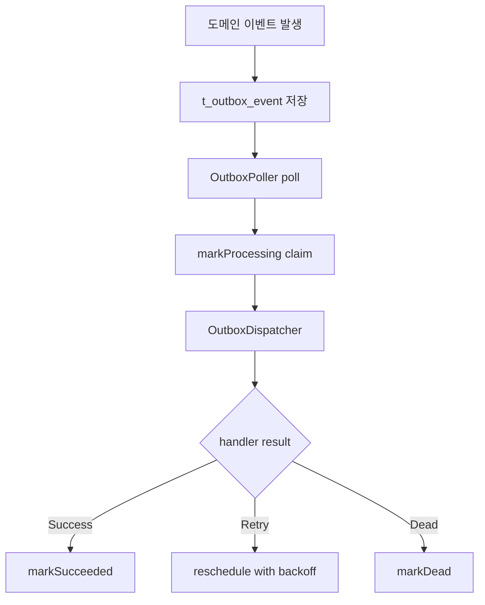

# Phase 2. Outbox Worker Runtime

## 현재 의미

이 문서는 현재 저장소에서 outbox worker 가 담당하는 범위를 설명한다.

과거에는 쿠폰 발급 request relay 와 reconciliation 까지 outbox 와 엮여 있었지만, 현재 구조에서는 그렇지 않다.

현재 outbox worker 의 책임은 하나다.

- `COUPON_ISSUED`
- `COUPON_USED`
- `COUPON_CANCELED`

같은 lifecycle domain event 를 durable 하게 후속 projection 으로 처리하는 것

즉, 공개 `POST /coupon-issues` intake 는 direct Kafka 이고, outbox worker 는 그 뒤에 붙는 activity projection runtime 이다.

## 구성 요소

| 구성 요소 | 역할 | 파일 |
| --- | --- | --- |
| Worker entrypoint | scheduling 이 켜진 독립 Boot 앱 | [`CouponWorkerApplication.kt`](../src/main/kotlin/com.coupon/CouponWorkerApplication.kt) |
| Worker config | batch size, fixed delay, retry 설정 | [`OutboxWorkerProperties.kt`](../src/main/kotlin/com.coupon/config/OutboxWorkerProperties.kt) |
| Poller | processable outbox 조회와 claim 시작점 | [`OutboxPoller.kt`](../src/main/kotlin/com.coupon/outbox/OutboxPoller.kt) |
| Dispatcher | handler 실행과 `SUCCEEDED/FAILED/DEAD` 전이 | [`OutboxDispatcher.kt`](../src/main/kotlin/com.coupon/outbox/OutboxDispatcher.kt) |
| Handler registry | `eventType` 별 handler 연결 | [`OutboxEventHandlerRegistry.kt`](../src/main/kotlin/com.coupon/outbox/OutboxEventHandlerRegistry.kt) |
| Coupon lifecycle handler | activity projection 처리 | [`CouponLifecycleOutboxEventHandler.kt`](../src/main/kotlin/com.coupon/outbox/CouponLifecycleOutboxEventHandler.kt) |
| Handler support | payload parse + `coupon_activity` 저장 | [`CouponLifecycleOutboxEventHandlerSupport.kt`](../src/main/kotlin/com.coupon/outbox/CouponLifecycleOutboxEventHandlerSupport.kt) |
| Metrics | poll, claim, retry, dead, duration 수집 | [`OutboxWorkerMetrics.kt`](../src/main/kotlin/com.coupon/outbox/OutboxWorkerMetrics.kt) |
| Health | worker runtime 상태 노출 | [`OutboxWorkerHealthIndicator.kt`](../src/main/kotlin/com.coupon/health/OutboxWorkerHealthIndicator.kt) |

## 처리 흐름



현재 coupon lifecycle handler 는 payload 를 읽어 `coupon_activity` projection 을 기록한다.

관련 파일:

- [`CouponLifecycleDomainEvent.kt`](../../coupon-domain/src/main/kotlin/com/coupon/coupon/event/CouponLifecycleDomainEvent.kt)
- [`CouponOutboxEventType.kt`](../../coupon-domain/src/main/kotlin/com/coupon/coupon/event/CouponOutboxEventType.kt)
- [`CouponActivityService.kt`](../../coupon-domain/src/main/kotlin/com/coupon/coupon/activity/CouponActivityService.kt)

## 설정

`worker.yml`

```yaml
worker:
  outbox:
    enabled: true
    batch-size: 100
    fixed-delay: 500ms
    initial-delay: 0ms
    max-retries: 10
    retry:
      initial-delay: 1s
      max-delay: 5m
      multiplier: 2.0
```

## 운영 포인트

- outbox backlog 는 lifecycle projection 지연을 의미한다
- outbox backlog 가 쌓여도 공개 issue intake 자체는 direct Kafka 경로라 바로 막히는 구조는 아니다
- 다만 `coupon_activity` projection 이 늦어질 수 있으므로 운영 관점에서는 계속 모니터링한다

## 검증

- `JAVA_HOME=$(/usr/libexec/java_home -v 25) ./gradlew :coupon:coupon-worker:test --no-daemon`
- `JAVA_HOME=$(/usr/libexec/java_home -v 25) ./gradlew :coupon:coupon-worker:compileKotlin --no-daemon`
