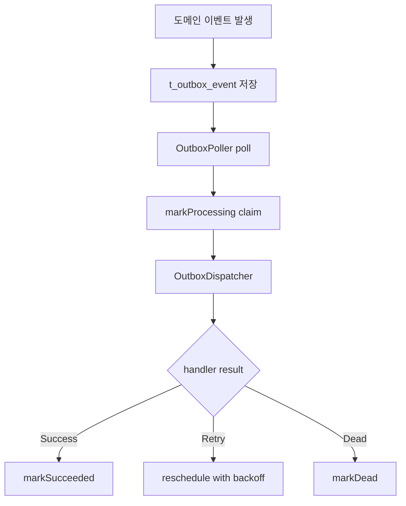

# Phase 2. Outbox Worker Runtime

## 현재 의미

이 문서는 현재 저장소에서 outbox worker 가 담당하는 범위를 설명한다.

과거에는 쿠폰 발급 request relay 와 reconciliation 까지 outbox 와 엮여 있었지만, 현재 구조에서는 그렇지 않다.

현재 outbox worker 의 책임은 하나다.

- `COUPON_ISSUED`
- `COUPON_USED`
- `COUPON_CANCELED`

같은 lifecycle domain event 를 durable 하게 후속 projection 으로 처리하는 것

즉, 공개 `POST /coupon-issues` intake 는 direct Kafka 이고, outbox worker 는 그 뒤에 붙는 activity projection runtime 이다.

현재 기준으로 domain 쪽에서 outbox row를 만드는 진입점은
[`CouponLifecycleOutboxListener.kt`](../../coupon-domain/src/main/kotlin/com/coupon/coupon/event/CouponLifecycleOutboxListener.kt) 이다.

## 구성 요소

| 구성 요소 | 역할 | 파일 |
| --- | --- | --- |
| Worker entrypoint | scheduling 이 켜진 독립 Boot 앱 | [`CouponWorkerApplication.kt`](../src/main/kotlin/com/coupon/CouponWorkerApplication.kt) |
| Worker config | batch size, fixed delay, retry 설정 | [`OutboxWorkerProperties.kt`](../src/main/kotlin/com/coupon/config/OutboxWorkerProperties.kt) |
| Poller | processable outbox 조회와 claim 시작점 | [`OutboxPoller.kt`](../src/main/kotlin/com/coupon/outbox/OutboxPoller.kt) |
| Dispatcher | handler 실행과 `SUCCEEDED/FAILED/DEAD` 전이 | [`OutboxDispatcher.kt`](../src/main/kotlin/com/coupon/outbox/OutboxDispatcher.kt) |
| Handler registry | `eventType` 별 handler 연결 | [`OutboxEventHandlerRegistry.kt`](../src/main/kotlin/com/coupon/outbox/OutboxEventHandlerRegistry.kt) |
| Coupon lifecycle handler | activity projection 처리 | [`CouponLifecycleOutboxEventHandler.kt`](../src/main/kotlin/com/coupon/outbox/CouponLifecycleOutboxEventHandler.kt) |
| Handler support | payload parse + `coupon_activity` 저장 | [`CouponLifecycleOutboxEventHandlerSupport.kt`](../src/main/kotlin/com/coupon/outbox/CouponLifecycleOutboxEventHandlerSupport.kt) |
| DEAD alert notifier | `DEAD` 전환 시 Slack alert orchestration | [`SlackOutboxDeadEventNotifier.kt`](../src/main/kotlin/com/coupon/outbox/SlackOutboxDeadEventNotifier.kt) |
| Slack client | Spring `RestClient` based webhook adapter | [`SlackWebhookMessageSender.kt`](../src/main/kotlin/com/coupon/outbox/notification/slack/SlackWebhookMessageSender.kt) |
| Metrics | poll, claim, retry, dead, duration 수집 | [`OutboxWorkerMetrics.kt`](../src/main/kotlin/com/coupon/outbox/OutboxWorkerMetrics.kt) |
| Health endpoints | Boot actuator health/liveness/readiness 노출 | [`application.yml`](../src/main/resources/application.yml) |

## 처리 흐름



현재 coupon lifecycle handler 는 payload 를 읽어 `coupon_activity` projection 을 기록한다.

관련 파일:

- [`CouponLifecycleDomainEvent.kt`](../../coupon-domain/src/main/kotlin/com/coupon/coupon/event/CouponLifecycleDomainEvent.kt)
- [`CouponOutboxEventType.kt`](../../coupon-domain/src/main/kotlin/com/coupon/coupon/event/CouponOutboxEventType.kt)
- [`CouponActivityService.kt`](../../coupon-domain/src/main/kotlin/com/coupon/coupon/activity/CouponActivityService.kt)

## 상태별 재처리 규칙

| 상태 | poll 대상 여부 | 다음 상태 | `SUCCEEDED` 가능 여부 | 의미 |
| --- | --- | --- | --- | --- |
| `PENDING` | 예 | `PROCESSING -> SUCCEEDED/FAILED/DEAD` | 가능 | 신규 outbox event |
| `FAILED` | 예 | `PROCESSING -> SUCCEEDED/FAILED/DEAD` | 가능 | retry 대상 |
| `PROCESSING` | 아니오 | timeout recovery 후 `FAILED` | 간접적으로 가능 | worker 가 claim 했지만 종료 전 전이 완료를 못 한 상태 |
| `DEAD` | 아니오 | 없음 | 불가 | terminal failure |

현재 구현 기준으로 worker 가 직접 다시 집는 상태는 `PENDING`, `FAILED` 두 가지다.

- `PROCESSING` 은 `worker.outbox.processing-timeout` 을 넘기면 stale event 로 판단한다
- stale `PROCESSING` 은 recovery query 로 `FAILED` 로 되돌린 뒤 다음 poll 에서 다시 처리한다
- `DEAD` 는 수동 조치 전까지 다시 `SUCCEEDED` 로 올리지 않는다

## DEAD Slack 알림

`markDead` 가 실제로 성공한 경우에만 best-effort Slack webhook 알림을 보낸다.

- 상태 전이 자체는 Slack 전송 성공 여부에 의존하지 않는다
- outbox 쪽은 `SlackMessageSender` 인터페이스에만 의존하고, webhook transport 는 adapter 가 담당한다
- 현재 adapter 는 Spring `RestClient` 와 JDK `HttpClient` 로 incoming webhook POST 를 수행한다
- webhook 호출 실패는 로그 경고로만 남기고 outbox row 는 그대로 `DEAD` 다
- alert message 에는 event id, type, aggregate, retry count, dead 전환 시각, reason 이 포함된다

설정 예시:

## 설정

`worker.yml`

```yaml
worker:
  outbox:
    enabled: true
    batch-size: 100
    fixed-delay: 500ms
    initial-delay: 0ms
    max-retries: 10
    retry:
      initial-delay: 1s
      max-delay: 5m
      multiplier: 2.0
    dead-alert:
      slack:
        enabled: false
        webhook-url: ${WORKER_OUTBOX_DEAD_SLACK_WEBHOOK_URL:}
        timeout: 3s
```

로컬 실행에서는 저장소 루트 `[.env](/Users/yunbeom/ybcha/coupon-system-design-kt/.env)`에 `WORKER_OUTBOX_DEAD_SLACK_ENABLED`, `WORKER_OUTBOX_DEAD_SLACK_WEBHOOK_URL`를 두는 방식을 권장한다. 예시는 `[.env.example](/Users/yunbeom/ybcha/coupon-system-design-kt/.env.example)`를 본다.

## 운영 포인트

- outbox backlog 는 lifecycle projection 지연을 의미한다
- outbox backlog 가 쌓여도 공개 issue intake 자체는 direct Kafka 경로라 바로 막히는 구조는 아니다
- 다만 `coupon_activity` projection 이 늦어질 수 있으므로 운영 관점에서는 계속 모니터링한다
- `coupon.outbox.worker.event.dead` 증가와 Slack DEAD alert 발생은 수동 확인이 필요한 terminal signal 로 본다
- `coupon.outbox.worker.event.recovered` 증가는 worker 가 `PROCESSING` 에서 복구한 건수이므로 timeout, shutdown, state transition failure 흔적과 같이 본다

## 검증

- `JAVA_HOME=$(/usr/libexec/java_home -v 25) ./gradlew :coupon:coupon-worker:test --no-daemon`
- `JAVA_HOME=$(/usr/libexec/java_home -v 25) ./gradlew :coupon:coupon-worker:compileKotlin --no-daemon`
