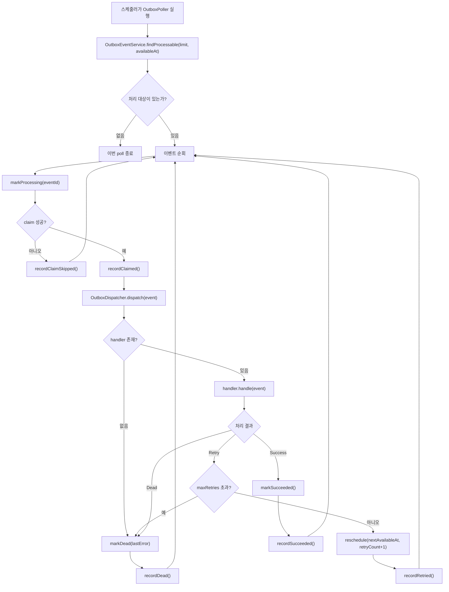
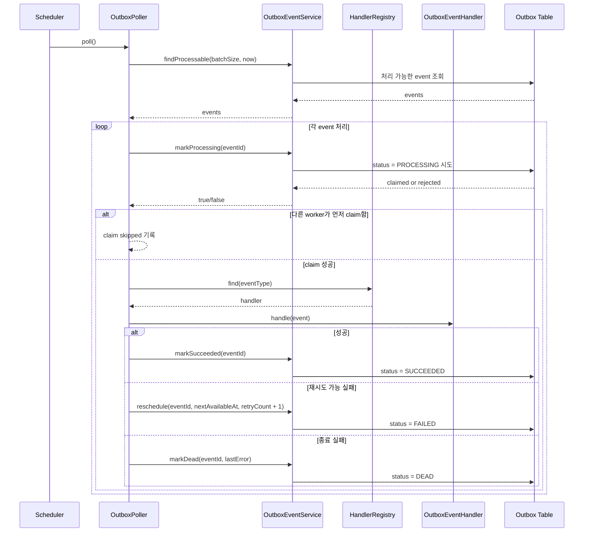

# Phase 2. Outbox Worker Runtime

## 1. 프로젝트 개요

### 목표
- API 프로세스가 아닌 전용 런타임이 영속화된 outbox event를 처리하도록 분리한다.
- 재시도 상태가 프로세스 재시작 이후에도 유지되도록 만든다.
- `eventType` 기준으로 handler를 확장할 수 있게 하되, 비즈니스 규칙은 인프라 계층으로 밀어 넣지 않는다.

### 이 모듈이 필요했던 이유
- Phase 1에서 `coupon-domain`과 `storage:db-core`에 durable outbox backbone은 만들어졌다.
- 하지만 그 시점에는 outbox event를 저장할 수만 있었고, 실제로 **poll, claim, dispatch, retry, dead-letter**를 수행하는 독립 런타임은 없었다.
- `coupon-worker`는 이 간극을 메우기 위해 추가된 전용 Spring Boot 실행 모듈이다.

### 이번 단계의 결과
- `coupon/coupon-worker` 아래에 독립 실행 worker 런타임을 추가했다.
- 현재 worker는 다음 책임을 수행한다.
  - 처리 가능한 outbox event 조회
  - 상태 전이를 이용한 안전한 claim
  - `eventType` 기반 dispatch
  - `SUCCEEDED`, `FAILED`, `DEAD` 상태 반영
  - 기본 health/metrics 노출

## 2. 아키텍처 요약

### 모듈 경계
- `coupon-api`
  - HTTP, security, request/response mapping 담당
- `coupon-domain`
  - outbox service, repository port, 상태 전이 계약 담당
- `storage:db-core`
  - outbox persistence, query 구현 담당
- `coupon-worker`
  - polling, dispatching, retry orchestration, 운영 관측성 담당

### 핵심 설계 원칙
- worker는 **비즈니스 서비스 계층이 아니라 실행 런타임**이다.
- 비즈니스 규칙은 계속 `coupon-domain`에 남긴다.
- worker는 다음만 책임진다.
  - 언제 가져올지
  - 누가 먼저 가져갔는지
  - 어떤 handler를 실행할지
  - 실행 결과를 어떤 상태로 기록할지

## 3. 구현된 구성 요소

| 구성 요소 | 역할 | 파일 |
|---|---|---|
| Worker entrypoint | scheduling이 켜진 독립 Boot 앱 | [`CouponWorkerApplication.kt`](../src/main/kotlin/com.coupon/CouponWorkerApplication.kt) |
| Worker config | batch size, delay, retry, enable/disable 설정 | [`OutboxWorkerProperties.kt`](../src/main/kotlin/com.coupon/config/OutboxWorkerProperties.kt) |
| Poller | 주기적 polling과 claim 시작점 | [`OutboxPoller.kt`](../src/main/kotlin/com.coupon/outbox/OutboxPoller.kt) |
| Dispatcher | handler 실행과 결과별 상태 전이 | [`OutboxDispatcher.kt`](../src/main/kotlin/com.coupon/outbox/OutboxDispatcher.kt) |
| Handler contract | `eventType`별 처리 인터페이스 | [`OutboxEventHandler.kt`](../src/main/kotlin/com.coupon/outbox/OutboxEventHandler.kt) |
| Handler registry | 중복 handler 방지와 `eventType` 기반 조회 | [`OutboxEventHandlerRegistry.kt`](../src/main/kotlin/com.coupon/outbox/OutboxEventHandlerRegistry.kt) |
| Retry policy | exponential backoff와 최대 재시도 제한 | [`OutboxRetryPolicy.kt`](../src/main/kotlin/com.coupon/outbox/OutboxRetryPolicy.kt) |
| Metrics | poll, claim, retry, dead-letter, duration 메트릭 수집 | [`OutboxWorkerMetrics.kt`](../src/main/kotlin/com.coupon/outbox/OutboxWorkerMetrics.kt) |
| Health | worker runtime 상태 노출 | [`OutboxWorkerHealthIndicator.kt`](../src/main/kotlin/com.coupon/health/OutboxWorkerHealthIndicator.kt) |
| Worker 설정 파일 | worker 전용 기본 실행 설정 | [`worker.yml`](../src/main/resources/worker.yml) |

## 4. 처리 흐름

### 런타임 흐름도


### 시퀀스 관점


## 5. 신뢰성 전략

### 왜 DB 기반 retry를 선택했는가
- retry 상태가 outbox table에 남는다.
- 프로세스가 재시작되어도 retry 이력이 사라지지 않는다.
- `retryCount`, `lastError`, 최종 `DEAD` 상태를 운영 관점에서 추적할 수 있다.
- 여러 worker 인스턴스가 동시에 떠 있어도 상태 전이 기반 claim으로 경쟁을 제어할 수 있다.

### 현재 retry 정책
- 기본 batch size: `100`
- poll 주기: `500ms`
- 최대 재시도: `10`
- exponential backoff
  - initial delay: `1s`
  - max delay: `5m`
  - multiplier: `2.0`

### 왜 `spring-retry`를 메인 메커니즘으로 쓰지 않았는가
- `spring-retry`는 짧은 in-process retry에는 유용하다.
- 하지만 이번 worker가 해결하는 문제는 **상태가 남는 durable retry**다.
- 그래서 현재 구조의 기준은 다음과 같다.
  - DB outbox가 source of truth
  - 필요하다면 나중에 특정 handler 내부에서만 `RetryTemplate`를 보조적으로 사용

## 6. 관측성

### Health
- [`OutboxWorkerHealthIndicator.kt`](../src/main/kotlin/com.coupon/health/OutboxWorkerHealthIndicator.kt) 에서 다음 정보를 노출한다.
  - enabled 여부
  - batch size
  - max retries
  - 등록된 handler 수
  - 등록된 event type 목록

### Metrics
- Poll 메트릭
  - `coupon.outbox.worker.poll.count`
  - `coupon.outbox.worker.poll.fetched`
- Event 메트릭
  - `coupon.outbox.worker.event.claimed`
  - `coupon.outbox.worker.event.claim.skipped`
  - `coupon.outbox.worker.event.succeeded`
  - `coupon.outbox.worker.event.retried`
  - `coupon.outbox.worker.event.dead`
  - `coupon.outbox.worker.event.duration`
- Registry 메트릭
  - `coupon.outbox.worker.handler.count`

## 7. 설정 구조

### 리소스 구성
- [`application.yml`](../src/main/resources/application.yml)
  - 공통 DB, logging, monitoring 설정을 import
  - worker application name과 port 설정
- [`worker.yml`](../src/main/resources/worker.yml)
  - worker 전용 runtime tuning 값을 별도 관리

### 기본 실행 설정
```yaml
worker:
  outbox:
    enabled: true
    batch-size: 100
    fixed-delay: 500ms
    initial-delay: 0ms
    max-retries: 10
```

## 8. 검증

### 실행한 검증 명령
- `./gradlew :coupon:coupon-worker:ktlintFormat`
- `JAVA_HOME=$(/usr/libexec/java_home -v 25) ./gradlew :coupon:coupon-worker:test --no-daemon`

### 테스트 범위
- [`OutboxEventHandlerRegistryTest.kt`](../src/test/kotlin/com/coupon/outbox/OutboxEventHandlerRegistryTest.kt)
  - 중복 handler 등록 방지
  - `eventType` 기반 handler 조회
- [`OutboxDispatcherTest.kt`](../src/test/kotlin/com/coupon/outbox/OutboxDispatcherTest.kt)
  - 성공 처리 시 `SUCCEEDED` 전이
  - handler 미등록 시 `DEAD` 전이
  - 예외 발생 시 retry scheduling
  - 최대 재시도 초과 시 dead-letter 전이

## 9. 의도적으로 남겨둔 범위

### 아직 포함하지 않은 것
- `USER_DELETION_*` 같은 실제 비즈니스 handler
- 현재 `@Async` 후처리를 outbox 기반 처리로 바꾸는 작업
- async coupon issue request API 계약 변경

### 왜 다음 단계로 미뤘는가
- Phase 2의 목적은 worker runtime의 기반을 안정적으로 만드는 것이다.
- 실제 비즈니스 event migration은 별도 리뷰 가능한 단위로 나누는 편이 안전하다.

## 10. 다음 단계

### Phase 3 handoff
- user deletion 후처리를 위한 실제 outbox handler 추가
- 현재 local async follow-up 흐름을 durable outbox production/worker consumption 구조로 전환
- worker runtime 자체는 유지하고 concrete handler만 연결

## 11. 포트폴리오 관점의 의미

이번 단계는 outbox를 단순한 저장 구조에서 **실행 가능한 비동기 처리 런타임**으로 확장한 작업이다.  
핵심 아키텍처 개선점은 관심사 분리다.

- API는 비동기 후처리 실행 책임을 갖지 않는다.
- Domain은 비즈니스 규칙과 상태 전이를 계속 소유한다.
- Worker는 실행, retry 제어, 운영 가시성을 담당한다.

이 분리가 있어야 다음 단계에서 실제 비즈니스 이벤트를 붙여도 애플리케이션 계층으로 인프라 복잡도가 다시 새어 들어오지 않는다.
