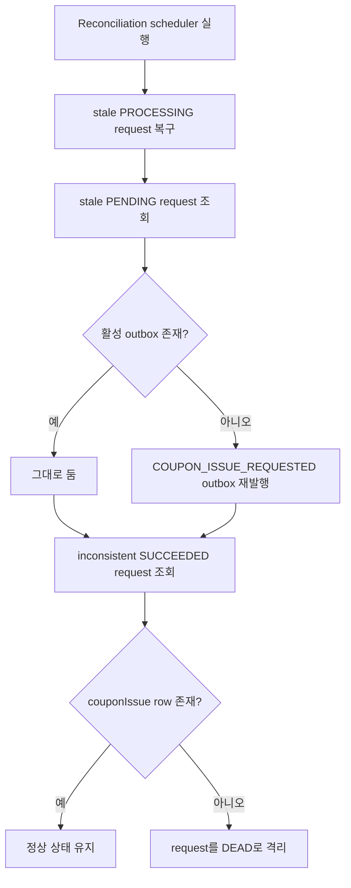

# Phase 4. Coupon Request Reconciliation

> 최신 전체 흐름은 [`coupon-kafka-runtime-guide.md`](./coupon-kafka-runtime-guide.md) 를 먼저 읽고, 이 문서는 reconciliation 단계만 따로 참고하는 것을 권장한다.

## 1. 목표

- `COUPON_ISSUE_REQUESTED` outbox가 복구되더라도 request가 `PROCESSING`에 영구 정지하지 않게 만든다.
- 오래된 `PENDING` request가 활성 outbox 없이 남아 있을 때 다시 큐잉한다.
- `SUCCEEDED`인데 실제 `couponIssue`가 없는 request를 `DEAD`로 격리해 조용한 불일치를 없앤다.

이번 단계의 초점은 성능이 아니라 `요청 유실 0`과 `애매한 상태 수렴`이다.

## 2. 왜 필요했는가

기존 durable workflow는 다음을 보장했다.

- request row 저장
- outbox row 저장
- worker 기반 비동기 실행
- stale outbox `PROCESSING` 복구

하지만 여기에는 남은 구멍이 있었다.

- worker가 request를 `PROCESSING`으로 바꾼 뒤 중단되면, outbox는 복구되어도 request는 계속 `PROCESSING`에 머물 수 있다.
- request는 `PENDING`인데 활성 outbox가 없으면 더 이상 실행 경로를 타지 못한다.
- request가 `SUCCEEDED`인데 실제 `couponIssue`가 없다면 사용자와 운영 모두 잘못된 성공 상태를 보게 된다.

이번 단계는 이 세 경로를 닫는 보정 layer다.

## 3. 추가된 구성 요소

| 구성 요소 | 역할 | 파일 |
|---|---|---|
| Reconciliation service | request 복구, 재큐잉, 불일치 격리 | [`CouponIssueRequestReconciliationService.kt`](../src/main/kotlin/com.coupon/../../../../coupon-domain/src/main/kotlin/com/coupon/coupon/request/CouponIssueRequestReconciliationService.kt) |
| Reconciliation scheduler | 주기적으로 보정 실행 | [`CouponIssueRequestReconciliationPoller.kt`](../src/main/kotlin/com.coupon/reconciliation/CouponIssueRequestReconciliationPoller.kt) |
| Reconciliation metrics | recovered / requeued / isolated 카운트 수집 | [`CouponIssueRequestReconciliationMetrics.kt`](../src/main/kotlin/com.coupon/reconciliation/CouponIssueRequestReconciliationMetrics.kt) |
| Reconciliation properties | batch size, timeout, schedule 설정 | [`CouponIssueRequestReconciliationProperties.kt`](../src/main/kotlin/com.coupon/config/CouponIssueRequestReconciliationProperties.kt) |

## 4. 처리 흐름



## 5. 핵심 정책

- `PROCESSING -> ENQUEUED` 복구는 bulk update로 수행한다.
- `PENDING` request는 활성 outbox가 없을 때만 재큐잉한다.
- outbox 재발행은 request idempotency key를 그대로 사용한다.
- `SUCCEEDED` 불일치는 숨기지 않고 `DEAD`로 전환해 명시적 실패 상태로 수렴시킨다.
- source of truth는 계속 DB이며, reconciliation은 그 DB 상태를 다시 맞추는 역할만 맡는다.

## 6. 기본 설정

```yaml
worker:
  coupon-issue-request-reconciliation:
    enabled: true
    batch-size: 100
    fixed-delay: 1s
    initial-delay: 1s
    processing-timeout: 5m
    pending-timeout: 30s
```

## 7. 관측성

- `coupon.issue.request.reconciliation.run.count`
- `coupon.issue.request.reconciliation.processing.recovered`
- `coupon.issue.request.reconciliation.pending.scanned`
- `coupon.issue.request.reconciliation.pending.requeued`
- `coupon.issue.request.reconciliation.succeeded.inconsistent.scanned`
- `coupon.issue.request.reconciliation.succeeded.inconsistent.isolated`
- `coupon.issue.request.reconciliation.duration`

## 8. 의미

이 단계부터 worker는 단순 consumer를 넘어 `self-healing` 역할을 일부 갖게 된다.  
핵심은 메시지를 더 빨리 처리하는 것이 아니라, 실패 이후에도 request가 결국 `PENDING / ENQUEUED / SUCCEEDED / FAILED / DEAD` 중 하나로 수렴하도록 만드는 것이다.
