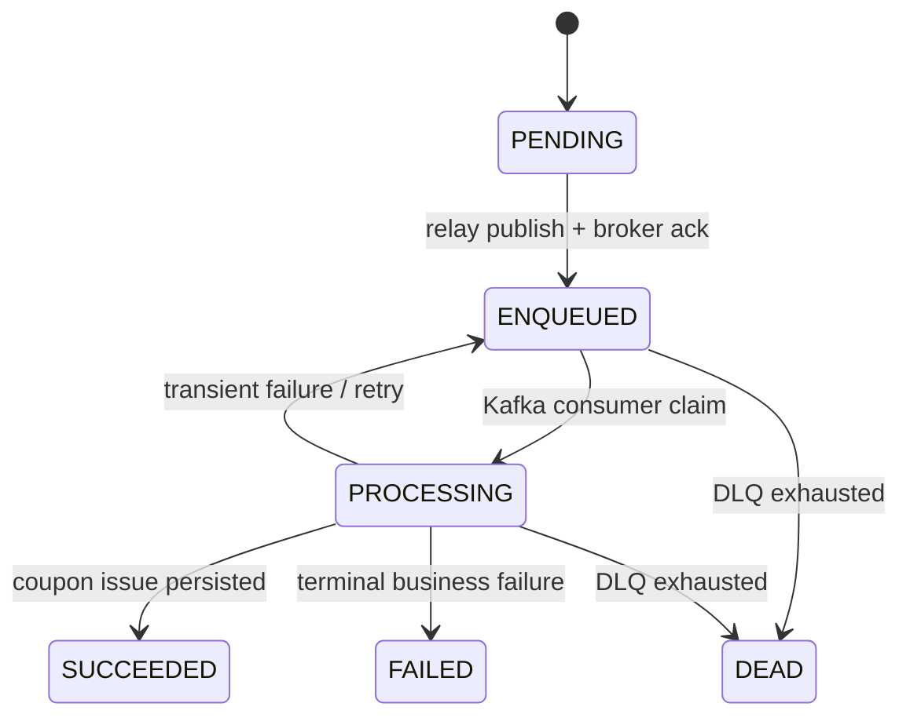
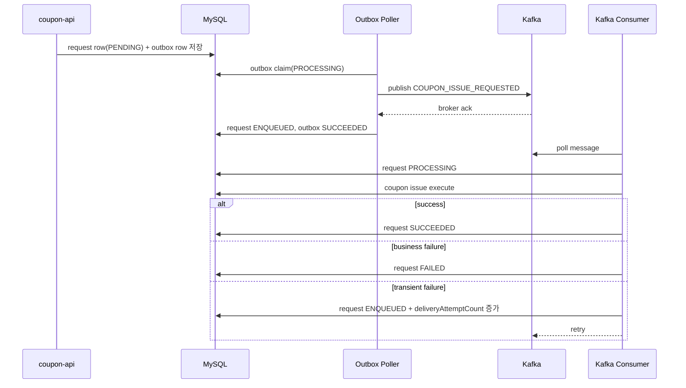

# Phase 5. Kafka Relay + Consumer

> 최신 전체 흐름은 [`coupon-kafka-runtime-guide.md`](./coupon-kafka-runtime-guide.md) 를 먼저 읽고, 이 문서는 Kafka 도입 단계의 설계 의도를 확인하는 용도로 참고한다.

## 목표

- `t_coupon_issue_request`를 source of truth로 유지한 채 Kafka를 command bus로 도입한다.
- `COUPON_ISSUE_REQUESTED` outbox의 의미를 "발급 완료"가 아니라 "Kafka enqueue 완료"로 재정의한다.
- request 상태를 `PENDING -> ENQUEUED -> PROCESSING -> SUCCEEDED|FAILED|DEAD`로 명확히 수렴시킨다.

## 구성 요소

| 구성 요소 | 역할 | 파일 |
| --- | --- | --- |
| Kafka properties | topic, group, retry, ack timeout 설정 | [`CouponIssueRequestKafkaProperties.kt`](../src/main/kotlin/com.coupon/config/CouponIssueRequestKafkaProperties.kt) |
| Kafka config | topic 생성, listener factory, DLT recoverer | [`CouponIssueRequestKafkaConfig.kt`](../src/main/kotlin/com.coupon/config/CouponIssueRequestKafkaConfig.kt) |
| Relay publisher | Kafka broker ack까지 기다리는 동기 publish | [`CouponIssueRequestKafkaPublisher.kt`](../src/main/kotlin/com.coupon/kafka/CouponIssueRequestKafkaPublisher.kt) |
| Outbox relay handler | outbox를 Kafka enqueue로 변환 | [`CouponIssueRequestedOutboxEventHandler.kt`](../src/main/kotlin/com.coupon/outbox/CouponIssueRequestedOutboxEventHandler.kt) |
| Kafka consumer | `ENQUEUED` request를 실제 발급으로 실행 | [`CouponIssueRequestKafkaListener.kt`](../src/main/kotlin/com.coupon/kafka/CouponIssueRequestKafkaListener.kt) |
| Kafka metrics | relay / retry / DLQ / oldest age 수집 | [`CouponIssueRequestKafkaMetrics.kt`](../src/main/kotlin/com.coupon/kafka/CouponIssueRequestKafkaMetrics.kt) |
| Docker runtime | app / worker / mysql / redis / kafka 공존 실행 | [`docker-compose.yml`](/Users/yunbeom/ybcha/coupon-system-design-kt/docker/docker-compose.yml) |

## 왜 로컬 compose는 ZooKeeper를 쓰지 않는가

- 이 단계의 목표는 Kafka command bus를 구조 안에 안전하게 넣는 것이지, Kafka 운영 토폴로지를 모두 재현하는 것이 아니다.
- 따라서 로컬 환경에서는 KRaft 기반 단일 브로커 구성을 사용해 `coupon-api`, `coupon-worker`, `mysql`, `redis`, `kafka`만으로 전체 플로우를 재현한다.
- 반대로 운영 인프라가 이미 ZooKeeper 기반 Kafka 표준을 가지고 있다면, 그쪽 compose로 바꾸는 것은 가능하다.

## 상태 전이

## 처리 흐름

## 핵심 결정

- request acceptance와 outbox 저장은 계속 같은 트랜잭션에 둔다.
- relay는 Kafka ack를 받을 때만 request를 `ENQUEUED`로 바꾼다.
- consumer는 `ENQUEUED`만 `PROCESSING`으로 올릴 수 있다.
- terminal business failure는 `FAILED`로 남기고 ack 한다.
- retryable failure만 Kafka retry + DLQ 경로를 탄다.
- DLQ는 request를 `DEAD`로 수렴시키는 최종 격리 경로다.

## 운영 포인트

- `coupon.issue.request.kafka.relay.success/fail/dead`
- `coupon.issue.request.kafka.consumer.retry`
- `coupon.issue.request.kafka.dlq`
- `coupon.issue.request.status.transition`
- `coupon.issue.request.status.oldest.age.seconds{status=*}`

## 검증

- `./gradlew :coupon:coupon-enum:ktlintFormat :coupon:coupon-domain:ktlintFormat :coupon:coupon-worker:ktlintFormat :storage:db-core:ktlintFormat`
- `./gradlew :coupon:coupon-domain:test :coupon:coupon-worker:test :storage:db-core:compileKotlin :storage:redis:compileKotlin --no-daemon`
