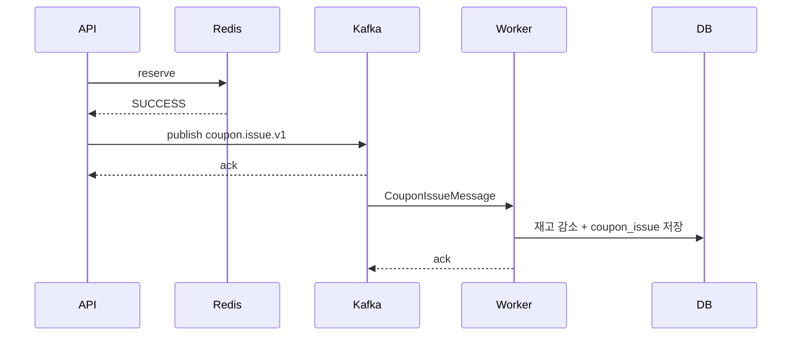

# Phase 5. Kafka Relay and Consumer

> 현재 저장소에서는 request relay 단계가 제거되었고 direct producer/consumer 구조로 대체되었다.

## 현재 구조

과거:

- DB request row 저장
- outbox relay 가 Kafka enqueue
- request status 전이

현재:

- API 가 Redis reserve 성공 후 Kafka 에 직접 publish
- worker consumer 가 메시지를 받아 실제 발급 실행
- request table 은 없다

## 현재 파일 기준

| 역할 | 파일 |
| --- | --- |
| direct Kafka publish | [`CouponIssueKafkaPublisher.kt`](../../coupon-api/src/main/kotlin/com.coupon/config/CouponIssueKafkaPublisher.kt) |
| topic / consumer / DLQ config | [`CouponIssueKafkaConfig.kt`](../src/main/kotlin/com.coupon/config/CouponIssueKafkaConfig.kt) |
| Kafka consumer | [`CouponIssueKafkaListener.kt`](../src/main/kotlin/com.coupon/kafka/CouponIssueKafkaListener.kt) |
| 발급 orchestration | [`CouponIssueFacade.kt`](../../coupon-domain/src/main/kotlin/com/coupon/coupon/CouponIssueFacade.kt) |
| 발급 domain service | [`CouponIssueService.kt`](../../coupon-domain/src/main/kotlin/com/coupon/coupon/CouponIssueService.kt) |

## 현재 시퀀스

## 운영 메모

- relay backlog 대신 지금은 consumer lag 와 DLQ 를 본다
- publish 실패는 API 요청 안에서 바로 드러난다
- retry 소진 후에는 DLQ listener 가 Redis reserve 를 풀어준다

최신 상세 설명은 [coupon-kafka-runtime-guide.md](./coupon-kafka-runtime-guide.md) 를 본다.
